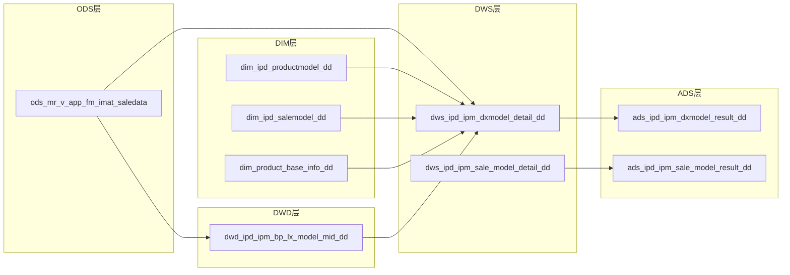

# 数据血缘可视化技能

## 触发词
用户说以下任意一种时激活本技能：
- "血缘"、"血缘图"、"依赖关系图"、"数据流向"
- "表依赖"、"上下游关系"、"影响范围图"

## 技能说明
解析所有需求的SQL脚本，自动提取表级和字段级血缘关系，生成可视化图表（Mermaid格式 + HTML页面）。

## 执行步骤

### 1. 确定分析范围

```
请选择血缘分析范围：
A. 全局（所有需求的所有SQL）
B. 指定需求（如"002"）
C. 指定表（如"dws_ipd_ipm_dxmodel_detail_dd"）
D. 影响分析（"改了XX表，影响哪些下游"）
```

### 2. 解析SQL脚本

遍历目标范围内的所有 `.sql` 文件（排除 `_draft.sql`），提取：

| 解析项 | 提取方式 |
|--------|----------|
| 目标表 | INSERT INTO / CREATE TABLE 后的表名 |
| 源表 | FROM / JOIN 后的表名 |
| 中间表 | test.xxx 开头的表（标记为临时） |
| 字段映射 | INSERT字段列表 ↔ SELECT表达式（尽力匹配） |

### 3. 构建血缘关系

#### 表级血缘（必须输出）
```
源表A ──→ 中间表X ──→ 目标表M
源表B ──┘              │
                       ▼
                    目标表N
```

#### 字段级血缘（可选，用户要求时输出）
```
源表.字段a ──→ 目标表.字段x（直接映射）
源表.字段b ──→ [CASE WHEN] ──→ 目标表.字段y（转换映射）
源表.字段c + 源表.字段d ──→ [SUM] ──→ 目标表.字段z（聚合映射）
```

### 4. 生成 Mermaid 图



### 5. 生成 HTML 可视化页面

将 Mermaid 图嵌入 HTML 页面，保存到 `project-docs/lineage-viz.html`。

HTML模板：
```html
<!DOCTYPE html>
<html lang="zh-CN">
<head>
    <meta charset="UTF-8">
    <title>数据血缘关系图</title>
    <script src="https://cdn.jsdelivr.net/npm/mermaid/dist/mermaid.min.js"></script>
    <style>
        body { font-family: 'Microsoft YaHei', sans-serif; margin: 20px; background: #f5f5f5; }
        h1 { color: #333; border-bottom: 2px solid #4CAF50; padding-bottom: 10px; }
        .info { color: #666; margin-bottom: 20px; }
        .mermaid { background: white; padding: 20px; border-radius: 8px; box-shadow: 0 2px 4px rgba(0,0,0,0.1); }
        .legend { margin-top: 20px; padding: 15px; background: white; border-radius: 8px; }
        .legend span { margin-right: 20px; }
        .stats { display: flex; gap: 20px; margin: 20px 0; }
        .stat-card { background: white; padding: 15px; border-radius: 8px; box-shadow: 0 2px 4px rgba(0,0,0,0.1); flex: 1; text-align: center; }
        .stat-card .number { font-size: 2em; font-weight: bold; color: #4CAF50; }
        .stat-card .label { color: #666; }
    </style>
</head>
<body>
    <h1>📊 数据血缘关系图</h1>
    <p class="info">生成时间：{timestamp} | 分析范围：{scope}</p>

    <div class="stats">
        <div class="stat-card"><div class="number">{n_source}</div><div class="label">源表数</div></div>
        <div class="stat-card"><div class="number">{n_target}</div><div class="label">目标表数</div></div>
        <div class="stat-card"><div class="number">{n_links}</div><div class="label">血缘链路数</div></div>
        <div class="stat-card"><div class="number">{n_requirements}</div><div class="label">涉及需求数</div></div>
    </div>

    <div class="mermaid">
    {mermaid_code}
    </div>

    <div class="legend">
        <h3>图例</h3>
        <span>🟢 ODS层（源数据）</span>
        <span>🔵 DIM层（维度）</span>
        <span>🟡 DWD层（明细）</span>
        <span>🟠 DWS层（汇总）</span>
        <span>🔴 ADS层（应用）</span>
    </div>

    <script>mermaid.initialize({startOnLoad: true, theme: 'default'});</script>
</body>
</html>
```

### 6. 输出摘要

```
═══════════════════════════════════════════
       🔗 数据血缘分析报告
       分析范围：{scope}
       生成时间：YYYY-MM-DD
═══════════════════════════════════════════

📊 统计
- 源表：{N}张（ODS:{n1} DIM:{n2} DW:{n3}）
- 目标表：{N}张（DWD:{n1} DWS:{n2} ADS:{n3}）
- 血缘链路：{N}条
- 中间表（test库）：{N}张

🔗 关键路径（最长链路）
{source} → ... → {target}（经过{N}层转换）

⚠️ 异常发现
- 孤立表（无上游也无下游）：{列表}
- 循环依赖：{列表 / 无}
- 未被任何ADS引用的DWS表：{列表}

📄 可视化文件已生成：project-docs/lineage-viz.html
═══════════════════════════════════════════
```

## 影响分析模式

当用户选择"D. 影响分析"时：

输入：用户指定一张表名
输出：
```
🎯 影响分析：{表名}

直接下游（1层）：
- {表1}（需求{ID}）
- {表2}（需求{ID}）

间接下游（2层+）：
- {表3}（需求{ID}）← 通过{表1}

受影响的ADS报表：
- {ads表}（需求{ID}）

建议：修改{表名}后，需同步检查以上{N}个下游表的逻辑。
```

## 与现有流程的协同

- **链路B影响分析（B3）**：Agent可调用本技能的影响分析模式，替代从 requirement_patterns.md 手动查找
- **auto-update-lineage hook**：该hook更新单个需求的lineage.md，本技能生成全局可视化，两者互补
- **project-dashboard 看板**：看板显示依赖关系文字版，本技能提供图形版

## 注意事项
- 通过 `#data-lineage-viz` 或 `#血缘` 手动引用激活
- 解析SQL时忽略注释中的表名
- _draft.sql 文件默认不纳入分析（除非用户指定"包含草稿"）
- 生成HTML时使用CDN加载Mermaid.js，需要网络访问才能渲染
- 如果SQL解析失败（如动态表名），标记为"⚠️ 无法解析"并跳过
