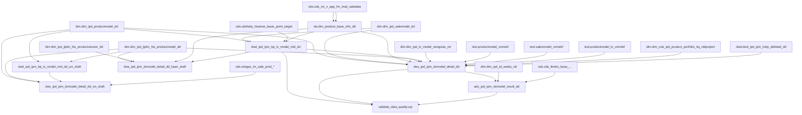

# 血缘关系文档 - 低效型号占比与新品规划命中率

## 基本信息
- **需求ID**: 002-dx-model-rate
- **血缘版本**: 2.0
- **生成日期**: 2026-04-23
- **最后更新**: 2026-07-13
- **状态**: 活跃
- **ADS脚本编码修复**: 2026-05-20（修复UTF-8乱码，移除厨电新品命中率ADS段）
- **ADS厨电产品线正式合并**: 2026-05-20（厨电产品线正式合并到ADS脚本ads_ipd_ipm_dxmodel_result_dd.sql，低效型号数+新品规划命中率两段均覆盖7条产品线，CHG-02产品线扩展）
- **DWS厨电段重新合并**: 2026-05-20（厨电低效型号数zhibiao_type='2' + 新品命中率zhibiao_type='4' 重新合并回正式脚本dws_ipd_ipm_dxmodel_detail_dd.sql，产品线统一为'厨电'）
- **视像科技OEM品牌剔除**: 2026-05-25（视像科技内销低效型号数+新品命中率两段is_project保护期判定新增OEM品牌剔除条件）
- **外销新品命中率DWS草稿**: 2026-05-26（新增外销DWS层草稿脚本dws_ipd_ipm_dxmodel_detail_dd_wx_draft.sql，时间频率改为针对昨天，覆盖7条外销产品线）
- **外销空调段GSS逻辑重构**: 2026-07-13（家空/轻商拆分：新增productline字段区分家空/轻商/其他；排产单状态扩展sale_stat IN(7,9)；batchno关联补充；家空内外机转换简化为直接×0.5不再关联HDRP；轻商增加productline='轻商'筛选；品牌剔除扩展为OEM/TOSHIBA/REGZA/HITACHI/YORK；产品类别判定改为'基型产品'；HDRP映射扩展含单元式整机；is_dx判定去掉多余COALESCE嵌套）
- **外销平板电视段退市剔除**: 2026-07-13（tv_wx_model CTE新增is_project_base判定条件：his_actualdelistingtime非空则标记为'Y'剔除，确保已退市型号不纳入外销新品命中率统计）
- **激光显示内销DWS草稿**: 2026-05-28（新增激光显示内销DWS层草稿脚本dws_ipd_ipm_dxmodel_detail_dd_jiguang_draft.sql，低效型号数+新品规划命中率两段，产品线激光家用/激光商用，CTE结构已完成）
- **激光显示产品线划分逻辑变更**: 2026-05-28（jiguang_model CTE中产品线划分从精确IN匹配改为LIKE模糊匹配+非空兜底：商用用LIKE '%激光-商用产品线%'，其余非空均归为激光家用）
- **激光显示内销正式合入**: 2026-06-08（激光低效型号数zhibiao_type='2' + 新品规划命中率zhibiao_type='4' 两段SQL从草稿合入正式脚本dws_ipd_ipm_dxmodel_detail_dd.sql，产品线：激光家用/激光商用，新增focallength字段，能效机转换PUB-005）
- **日立效率看板优化**: 2026-06-11（中央空调型号口径zhibiao_type='2'段：新增is_project_nk内控保护期+6个明细字段+shangshi_y；sale_model CTE外销品牌WHERE扩展为Hisense/HITACHI/YORK；项目口径zhibiao_type='2'段重写：新增rili_nkjt集团/内控双维度+shangshi_y+is_db_*；新增二级项目维度'2-1'营销部/'2-2'所有者/'2-3'产品小类）
- **家用空调项目口径合入**: 2026-06-11（新增家用空调项目口径zhibiao_type='2'和'4'两段：从DWS型号口径数据聚合到项目维度，仅保留is_project='N'且project_code非空的记录，按project_code+project_name+kt_nbzz分组汇总）
- **视像科技复产型号关联修复**: 2026-06-13（视像科技内销低效型号数段：补充fuchan_model CTE的LEFT JOIN关联，使is_project判定中"本年复产不考核"条件生效）
- **空气事业部家用空调复产型号CTE补充**: 2026-06-13（家用空调低效型号数zhibiao_type='2'段：补充fuchan_model CTE定义，使is_project判定中"本年复产不考核"条件生效。CTE从dwd.dwd_ipd_ipm_hdrp_delisted_dd取masterDataType='productModel'且formtype='再上市'的本年记录）
- **冰冷洗新品命中率复产型号CTE补充**: 2026-06-13（冰冷洗内销新品规划命中率zhibiao_type='4'段：补充fuchan_model CTE定义+LEFT JOIN关联，使is_project判定中"本年复产不考核"条件生效）
- **厨电低效型号数复产型号LEFT JOIN补充**: 2026-06-13（厨电内销低效型号数zhibiao_type='2'段：补充fuchan_model LEFT JOIN关联+is_project条件引用，使"本年复产不考核"保护期条件生效。CTE定义已存在，本次补充关联和条件引用）

## 数据流转概览
```
[DWD层] dwd_ipd_ipm_bp_lx_model_mid_dd（内销）
  ← dim.dim_ipd_productmodel_dd (LX立项：产品型号口径)
  ← dim.dim_ipd_salemodel_dd (LX立项：销售型号编码口径)
  ← ods.odshdrp_hisense_basis_point_target + dw.dim_product_base_info_dd (BP目标)

[DWD层] dwd_ipd_ipm_bp_lx_model_mid_dd_wx_draft（外销，草稿）
  ← dim.dim_ipd_productmodel_dd (外销LX：HX00020按比例拆分12个月)
  ← dim.dim_ipd_jtplm_his_productmodel_dd (显示/激光外销LX)
         ↓
[DWS层] dws_ipd_ipm_dxmodel_detail_dd（内销，正式脚本）
  ← dim.dim_ipd_productmodel_dd (型号基础信息、保护期判断)
  ← dim.dim_ipd_salemodel_dd (日立销售型号信息)
  ← ods.ods_mr_v_app_fm_imat_saledata → dw.dim_product_base_info_dd (实际销量)
  ← dwd.dwd_ipd_ipm_bp_lx_model_mid_dd (规划销量)
  ← test.productmodel_xmndxf (项目开发难度，冰冷洗+空调)
  ← test.salesmodel_xmndxf (销售型号编码对应项目开发难度，日立)
  ← test.productmodel_tv_xmndxf (视像科技产品型号对应项目开发难度)
  ← dim.dim_ipd_tv_model_nengxiao_nd (视像科技能效机→原型机映射)
  ← dim.dim_ipd_jtplm_his_productmodel_dd (视像科技产品型号信息)
  ← dim.dim_rule_ipd_product_portfolio_kq_oldproject (空气璀璨品牌排除)
  ← dwd.dwd_ipd_ipm_hdrp_delisted_dd (本年复产/再上市型号判定)
  ← dim.dim_ipd_productmodel_dd (厨电产品型号信息，HX00223判定产品线)
  【厨电段】低效型号数(zhibiao_type='2') + 新品命中率(zhibiao_type='4') 已重新合并回正式脚本（2026-05-20）
         产品线统一为'厨电'，覆盖：烟机/灶具/洗碗机/电热水器/燃气热水器/烤箱（内销）
  【激光段】低效型号数(zhibiao_type='2') + 新品命中率(zhibiao_type='4') 已合入正式脚本（2026-06-08）
         产品线：激光家用/激光商用（内销），含能效机转换(PUB-005)、焦距字段(focallength)
  ← dim.dim_ipd_jtplm_his_productmodel_dd (激光产品型号信息：产品公司=激光显示)
  ← dim.dim_ipd_jtplm_his_productversion_dd (激光产品线划分+立项国家及区域)
  ← dim.dim_ipd_tv_model_nengxiao_nd (激光能效机→原型机映射，同视像科技)
  【日立优化段】（2026-06-11）中央空调型号口径zhibiao_type='2'：
    新增字段：is_project_nk, HX00327, PG00039, HX00339, productmodel_life, PG00009, shangshi_y, is_db_qty, is_db_amt, is_db_margin
    sale_model CTE外销品牌WHERE扩展为('Hisense','HITACHI','YORK')
    项目口径zhibiao_type='2'重写：CROSS JOIN weidu_koujing双维度(集团/内控)
    新增二级项目维度：'2-1'营销部, '2-2'所有者, '2-3'产品小类（仅中央空调）
  【家用空调项目口径段】（2026-06-11）
    zhibiao_type='2' + '4' 家用空调项目口径：从DWS型号口径(is_project='N')按project_code聚合
    筛选条件：中央空调取全部、轻商内销取model_label_23='N'
    GROUP BY：dt_month, product_line, zhibiao_type, project_code, project_name, kt_nbzz, in_out_sale(中央空调为null)

[DWS层] dws_ipd_ipm_dxmodel_detail_dd_wx.sql（外销，正式脚本）
  ← dim.dim_ipd_productmodel_dd (冰冷洗/空调/厨电型号信息+剔除规则)
  ← dim.dim_ipd_jtplm_his_productmodel_dd (平板电视/激光型号信息)
  ← dwd.dwd_ipd_ipm_bp_lx_model_mid_dd (外销LX规划量)
  ← dwd.dwd_ipd_ipm_hdrp_delisted_dd (本年复产/再上市型号判定)
  ← ods.odsgss_im_sale_prod_header + ods.odsgss_im_sale_prod_line + ods.odsgss_im_sale_prod_kf_line (空调GSS排产单实际销量)
  ← ods.odsgss_im_order_agreement + ods.odsgss_im_rolling_plan_detail + 产品对照表 (冰冷洗GSS协议订单)
  ← ods.odsgss_im_sales_order_title (电视GSS订单)
  ← ods.odsgss_im_cw_order_ledger (厨电GSS协议订单)
  ← ods.odsgss_im_jg_order (激光GSS订单)
  ← dw.dim_product_base_info_dd (电视/激光型号映射：short_desc_zh→model_name)
  ← dim.dim_ipd_jtplm_his_productversion_dd (平板电视立项国家及区域：countries_regions)
  ← ods.odsgss_im_ecc_pln_bd_product_title / lg_product_title / xyj_product_title (冰冷洗产品对照)
  ← ods.odsgss_im_grs_dic (协议状态字典)
  【外销新品命中率】zhibiao_type='4'，覆盖：冰箱/冷柜/洗衣机/家用空调/平板电视/厨电/激光
  【时间频率】针对昨天（${GP_START_DT}），非上月
  【空调段核心逻辑（2026-07-13更新）】：
    - GSS排产单：sale_stat IN (7,9)，新增batchno关联条件
    - 新增productline分组字段：按bigc_name区分家空/轻商/其他
    - 家空整机(item_type=1)直接计入；家空内外机(item_type IN 2,3)直接×0.5计入（不再关联HDRP映射）
    - 轻商整机通过hdrp_mapping拆分到内机/外机；轻商内外机直接计入
    - hdrp_mapping扩展：pg00004 IN ('分体式空调器整机','单元式整机')
    - 品牌剔除扩展：OEM品牌/TOSHIBA/REGZA/HITACHI/YORK
    - 产品类别判定：基型产品（非基准机型）
  【状态】✅ 已闭环（2026-06-08）→ 2026-07-13空调段GSS逻辑重构 → 2026-07-13平板电视段退市剔除+countries_regions字段新增

[DWS层] dws_ipd_ipm_dxmodel_detail_dd_laser_draft（激光显示内销，草稿）
  ← dim.dim_ipd_jtplm_his_productmodel_dd (激光产品型号信息：上下市时间、品牌、产品小类、产品平台)
  ← dim.dim_ipd_jtplm_his_productversion_dd (产品线划分：his_pmdproductlinename LIKE模糊匹配+非空兜底 + 焦距：his_focallength)
  ← ods.ods_mr_v_app_fm_imat_saledata → dw.dim_product_base_info_dd (管报实际销量)
  ← dwd.dwd_ipd_ipm_bp_lx_model_mid_dd (BP+LX规划销量)
  【低效型号数】zhibiao_type='2'，产品线：激光家用/激光商用（内销）
  【新品规划命中率】zhibiao_type='4'，产品线：激光家用/激光商用（内销），新品期12个月
  【焦距字段】新品命中率段新增focal_length字段（需ALTER TABLE）
  【退市节点】使用his_stopproductiontime（停止下单），激光无退市准备节点
  【产品线划分】LIKE模糊匹配+非空兜底（商用用LIKE '%激光-商用产品线%'，其余非空归激光家用）
  【状态】✅ 已合入正式脚本（2026-06-08，逻辑已合并到dws_ipd_ipm_dxmodel_detail_dd.sql）
         ↓
[ADS层] ads_ipd_ipm_dxmodel_result_dd
  ← dws.dws_ipd_ipm_dxmodel_detail_dd (明细汇总)
  ← dim.dim_ipd_td_weidu_nd (维度配置)
  ← ods.ods_feishu_base_... (计划值)
  【低效型号数 zhibiao_type='2'】
    - 产品线级：冰箱/冷柜/洗衣机/家用空调/平板电视/中央空调/厨电（内销，中央空调取全部）
    - 事业部级：空气事业部/冰冷事业部（全部产品线汇总）+ 集团汇总
  【新品规划命中率 zhibiao_type='4'】
    - 产品线级：冰箱/冷柜/洗衣机/家用空调/平板电视/中央空调/厨电（内销，中央空调取全部）
    - 事业部级：空气事业部/冰冷事业部（全部产品线汇总）+ 集团汇总
  【状态】厨电产品线已正式合并到ADS脚本(ads_ipd_ipm_dxmodel_result_dd.sql)，低效型号数+新品规划命中率两段均覆盖7条产品线
         ↓
[数据质量检查] validate_data_quality.sql
  → dwd.dwd_ipd_ipm_bp_lx_model_mid_dd (行数检查)
  → dws.dws_ipd_ipm_dxmodel_detail_dd (行数检查、关键字段空值率检查)
  → ads.ads_ipd_ipm_dxmodel_result_dd (行数检查、指标合理性检查、产品线覆盖检查)
```

## 血缘关系图


## 核心关联路径

### 实际销量获取路径
1. 冰箱/冷柜/洗衣机/家空：`ods管报.matnr` → `dw.MDG.product_code` → `dw.MDG.model_name` → 按产品型号汇总
2. 日立中央空调：`ods管报.matnr` → `dw.MDG.product_code` → `dw.MDG.sale_model_code` → 按销售型号编码汇总
3. 平板电视：`ods管报.matnr` → `dw.MDG.product_code` → `dw.MDG.model_name` → 能效机映射 → 按产品型号汇总
4. 厨电（已合并回正式脚本）：`ods管报.matnr` → `dw.MDG.product_code` → `dw.MDG.model_name` → 按产品型号汇总
5. 激光显示（已合入正式脚本）：`ods管报.matnr` → `dw.MDG.product_code` → `dw.MDG.model_name` → 能效机映射(dim_ipd_tv_model_nengxiao_nd) → 按产品型号汇总

### 规划销量获取路径
1. LX立项（产品型号口径）：`dim.dim_ipd_productmodel_dd` 的36个月规划销量字段展开为分月记录
2. LX立项（销售型号编码口径）：`dim.dim_ipd_salemodel_dd` 的36个月规划销量字段展开为分月记录
3. BP目标：`ods.odshdrp_hisense_basis_point_target` 的12个月销量展开为分月记录
4. 厨电LX立项（已合并回正式脚本）：`dwd.dwd_ipd_ipm_bp_lx_model_mid_dd` 筛选 `plan_type='LX' AND product_big IN ('供热采暖类产品','厨房电器类产品')`
5. 厨电BP+LX（已合并回正式脚本）：`dwd.dwd_ipd_ipm_bp_lx_model_mid_dd` 筛选 BP(HDRP, product_big IN ('供热采暖类产品','厨房电器类产品')) + LX(`product_big IN ('供热采暖类产品','厨房电器类产品')`)

## 详细血缘关系

### 1. 源表（输入）
| 表名 | 数据库 | 用途 |
|------|--------|------|
| ods_mr_v_app_fm_imat_saledata | ods | 管报实际销量数据 |
| odshdrp_hisense_basis_point_target | ods | BP规划目标数据 |
| ods_feishu_base_... | ods | 飞书计划值数据 |
| dim_ipd_productmodel_dd | dim | 白电产品型号基础信息 |
| dim_ipd_salemodel_dd | dim | 白电销售型号基础信息 |
| dim_product_base_info_dd | dw | MDG产品主数据（桥梁表） |
| dim_ipd_td_weidu_nd | dim | 维度配置表 |
| dim_ipd_jtplm_his_productmodel_dd | dim | 视像科技产品型号信息 |
| dim_ipd_jtplm_his_productversion_dd | dim | 视像科技生产版本（项目开发难度映射） |
| dim_ipd_tv_model_nengxiao_nd | dim | 视像科技能效机→原型机映射 |
| dim_ipd_productionversion_dd | dim | 生产版本（项目开发难度映射） |
| dim_ipd_hdrp_project_dd | dim | HDRP项目信息（开发难度细分） |
| dim_rule_ipd_product_portfolio_kq_oldproject | dim | 空气璀璨品牌排除规则 |
| odsjtplm_his_marketablemachine | ods | 视像科技可上市机型（验证类型/项目开发难度） |
| dim_date_nd | dw | 日期维度主表 |
| dwd_ipd_ipm_hdrp_delisted_dd | dwd | 再上市/复产型号信息（本年复产判定） |

### 2. 中间表（ETL产出）
| 表名 | 数据库 | 分层 | 用途 |
|------|--------|------|------|
| dwd_ipd_ipm_bp_lx_model_mid_dd | dwd | DWD | BP及LX规划销量分月数据 |
| dws_ipd_ipm_dxmodel_detail_dd | dws | DWS | 低效型号明细数据 |
| productmodel_xmndxf | test | 中间表 | 产品型号对应的项目开发难度（CTAS临时表） |
| salesmodel_xmndxf | test | 中间表 | 销售型号编码对应的项目开发难度（CTAS临时表） |
| productmodel_tv_xmndxf | test | 中间表 | 视像科技产品型号对应的项目开发难度（CTAS临时表） |

### 3. 目标表（输出）
| 表名 | 数据库 | 用途 |
|------|--------|------|
| ads_ipd_ipm_dxmodel_result_dd | ads | 低效型号占比与新品命中率结果表 |

## 数据质量检查血缘（validate_data_quality.sql）

### 检查脚本源表
| 被检查表 | 数据库 | 检查类型 | 检查字段 |
|----------|--------|----------|----------|
| dwd_ipd_ipm_bp_lx_model_mid_dd | dwd | 行数检查 | dt_month |
| dws_ipd_ipm_dxmodel_detail_dd | dws | 行数检查 | dt_month |
| dws_ipd_ipm_dxmodel_detail_dd | dws | 关键字段空值率 | product_line, model |
| ads_ipd_ipm_dxmodel_result_dd | ads | 行数检查 | dt_month |
| ads_ipd_ipm_dxmodel_result_dd | ads | 指标合理性 | dxmodel_rate |
| ads_ipd_ipm_dxmodel_result_dd | ads | 产品线覆盖完整性 | product_line |

### 字段级血缘（数据质量检查）
| 源字段 | 源表 | 检查逻辑 | 预期结果 |
|--------|------|----------|----------|
| dt_month | dwd.dwd_ipd_ipm_bp_lx_model_mid_dd | COUNT(*) > 0 | 当月数据行数大于0 |
| dt_month | dws.dws_ipd_ipm_dxmodel_detail_dd | COUNT(*) > 0 | 当月数据行数大于0 |
| product_line | dws.dws_ipd_ipm_dxmodel_detail_dd | 空值率 = 0 | 产品线字段无空值 |
| model | dws.dws_ipd_ipm_dxmodel_detail_dd | 空值率 = 0 | 型号字段无空值 |
| dt_month | ads.ads_ipd_ipm_dxmodel_result_dd | COUNT(*) > 0 | 当月数据行数大于0 |
| dxmodel_rate | ads.ads_ipd_ipm_dxmodel_result_dd | 值域 [0, 1] | 低效型号占比在合理范围 |
| product_line | ads.ads_ipd_ipm_dxmodel_result_dd | DISTINCT COUNT >= 7 | 7条产品线全覆盖 |

### 检查规则说明
| 检查编号 | 检查表 | 检查类型 | 规则描述 |
|----------|--------|----------|----------|
| 1 | dwd.dwd_ipd_ipm_bp_lx_model_mid_dd | 行数检查 | 上月数据行数 > 0，确保DWD层数据已加载 |
| 2 | dws.dws_ipd_ipm_dxmodel_detail_dd | 行数检查 | 上月数据行数 > 0，确保DWS层数据已加载 |
| 3 | dws.dws_ipd_ipm_dxmodel_detail_dd | 关键字段空值率 | product_line和model字段空值率为0 |
| 4 | ads.ads_ipd_ipm_dxmodel_result_dd | 行数检查 | 上月数据行数 > 0，确保ADS层数据已加载 |
| 5 | ads.ads_ipd_ipm_dxmodel_result_dd | 指标合理性 | dxmodel_rate在[0,1]范围内 |
| 6 | ads.ads_ipd_ipm_dxmodel_result_dd | 产品线覆盖 | 至少覆盖7条产品线 |

### 影响分析

#### 正向追溯（从源到目标）
```
dim.dim_ipd_productmodel_dd ──┐
dim.dim_ipd_salemodel_dd ─────┤
ods.odshdrp_hisense_basis_... ┼──→ dwd.dwd_ipd_ipm_bp_lx_model_mid_dd ──┐
dw.dim_product_base_info_dd ──┘                                           │
                                                                          ├──→ dws.dws_ipd_ipm_dxmodel_detail_dd ──→ ads.ads_ipd_ipm_dxmodel_result_dd
ods.ods_mr_v_app_fm_imat_saledata ──→ dw.dim_product_base_info_dd ────────┘
                                                                                         │
                                                                          validate_data_quality.sql（质量验证）
```

#### 反向影响（从目标到源）
- `ads.ads_ipd_ipm_dxmodel_result_dd` 依赖 → `dws.dws_ipd_ipm_dxmodel_detail_dd` → `dwd.dwd_ipd_ipm_bp_lx_model_mid_dd` → 源表
- `validate_data_quality.sql` 读取 → DWD/DWS/ADS三层表，验证ETL全链路数据质量

## 视像科技（平板电视）保护期判定逻辑（is_project）

### 低效型号数（zhibiao_type='2'）保护期判定
| 条件 | 结果 | 说明 |
|------|------|------|
| his_actualtimetomarket >= 本月1日 | 'Y' | 本月上市为第0月，不纳入总数 |
| title IN (能效机映射表model_nengxiao) | 'Y' | 能效机不考核 |
| shangshi_m <= 3 | 'Y' | 上市3个月内不考核（第4个月开始） |
| coalesce(brand,'0') = 'OEM品牌' | 'Y' | 剔除OEM品牌（2026-05-25新增） |
| t_fuchan.masterDataName IS NOT NULL | 'Y' | 本年复产不考核（2026-06-13修复JOIN） |
| 其他 | 'N' | 纳入指标统计 |

### 新品规划命中率（zhibiao_type='4'）保护期判定
| 条件 | 结果 | 说明 |
|------|------|------|
| his_actualtimetomarket >= 本月1日 | 'Y' | 本月上市为第0月，不纳入总数 |
| title IN (能效机映射表model_nengxiao) | 'Y' | 能效机不考核 |
| shangshi_m >= 13 | 'Y' | 超过12个月新品期不纳入 |
| shangshi_m <= 3 | 'Y' | 上市3个月内不考核（第4个月开始） |
| coalesce(brand,'0') = 'OEM品牌' | 'Y' | 剔除OEM品牌（2026-05-25新增） |
| t_fuchan.masterDataName IS NOT NULL | 'Y' | 本年复产不考核（2026-06-13修复JOIN） |
| 其他 | 'N' | 纳入指标统计 |

### 与冰冷洗/厨电保护期判定的差异
| 差异点 | 冰冷洗 | 视像科技 | 厨电 |
|--------|--------|----------|------|
| 能效机剔除 | 无 | 有（能效机不考核） | 无 |
| OEM品牌剔除 | 无（通过gorenje品牌剔除） | 有（OEM品牌='Y'） | 有（非Hisense品牌剔除） |
| ODM剔除 | 有（is_odm判定） | 无 | 无 |
| 新品期限制（命中率段） | 无 | 有（12个月） | 有（12个月） |
| gorenje品牌剔除 | 有 | 无 | 无 |
| 本年复产不考核 | 有（fuchan_model CTE） | 有（fuchan_model CTE） | 有（fuchan_model CTE） |

## 厨电/激光/外销 字段级血缘（精简指引）

> **瘦身说明**（2026-06-08）：以下产品线扩展的完整字段级血缘已从本文件移除。
> 字段级血缘的唯一真相来源是正式SQL脚本本身。需要时直接读取对应脚本即可。

### 厨电（已合入正式脚本，2026-05-20）
- **血缘结构**：同冰箱段，差异点见上方"保护期判定差异表"
- **关键差异**：产品线判定用HX00223（非PG00002/003/004组合）；无ODM剔除；品牌只保留Hisense
- **规划量**：低效段BP+LX组合（product_big IN '供热采暖类产品','厨房电器类产品'），命中率段仅LX
- **详细逻辑**：见 `dws_ipd_ipm_dxmodel_detail_dd.sql` 中厨电段CTE

### 激光（已合入正式脚本，2026-06-08）
- **血缘结构**：数据源从PLM系统（dim_ipd_jtplm_his_productmodel_dd），非白电dim_ipd_productmodel_dd
- **关键差异**：产品线通过生产版本表(his_pmdproductlinename)判定；新增focallength字段；能效机转换PUB-005
- **规划量**：低效段BP+LX(product_line='激光')，命中率段仅LX
- **详细逻辑**：见 `dws_ipd_ipm_dxmodel_detail_dd.sql` 中激光段CTE

### 外销新品命中率（已闭环，2026-06-08；空调段重构 2026-07-13）
- **独立脚本**：`dws_ipd_ipm_dxmodel_detail_dd_wx.sql`
- **血缘结构**：7条产品线各自独立段落，每段包含型号CTE + GSS销量CTE + LX规划CTE + 复产CTE + 最终SELECT
- **关键差异**：实际销量来自GSS系统（PUB-009空调排产单、PUB-010其他协议订单）；规划量仅LX；时间频率针对昨天（非上月）
- **2026-07-13空调段变更**：
  - GSS排产单状态扩展：sale_stat IN (7,9)（原仅7）
  - 新增batchno关联条件：oisph.batchno = oispkl.batchno
  - 新增productline分组：按bigc_name(家用出口空调/家用房间空调/除湿机→家空，中央空调/商用出口空调→轻商)
  - 家空内外机转换简化：item_type IN (2,3)直接×0.5计入prdct_model（不再通过hdrp_mapping查找整机）
  - 轻商筛选增加productline='轻商'条件
  - hdrp_mapping CTE扩展：pg00004 IN ('分体式空调器整机','单元式整机')
  - 品牌剔除扩展：COALESCE(PG00005,'') IN ('OEM品牌','TOSHIBA','REGZA','HITACHI','YORK')
  - 产品类别判定修正：'基型产品'（原'基准机型'）
  - is_dx判定优化：去掉多余COALESCE嵌套（全部5个产品线段统一修正）
- **2026-07-13平板电视段变更**：
  - tv_wx_model CTE新增is_project_base判定条件：`WHEN COALESCE(his_actualdelistingtime, '') != '' THEN 'Y'`
  - 含义：已退市型号（his_actualdelistingtime非空）标记为保护期，不纳入外销新品命中率统计
  - 位置：品牌限定条件之后、只选上市条件之前
- **2026-07-13平板电视段新增countries_regions字段**：
  - 新增源表依赖：`dim.dim_ipd_jtplm_his_productversion_dd`（通过modelname关联tv_wx_model.PG00061）
  - 新增字段：countries_regions（立项国家及区域，group_concat(distinct countries_regions)）
  - JOIN方式：LEFT JOIN子查询t5 ON t1.PG00061 = t5.modelname
  - 子查询筛选：his_productsmallcategories = '平板电视'
- **详细逻辑**：见 `dws_ipd_ipm_dxmodel_detail_dd_wx.sql` 各段

### ADS层汇总
- **血缘结构**：从DWS明细表汇总，按维度配置表生成产品线级+事业部级+集团级
- **当前覆盖**：低效型号数+新品命中率 各7条内销产品线（冰箱/冷柜/洗衣机/家用空调/平板电视/中央空调/厨电）
- **详细逻辑**：见 `ads_ipd_ipm_dxmodel_result_dd.sql`

### 日立效率看板优化（2026-06-11）
- **变更脚本**：`dws_ipd_ipm_dxmodel_detail_dd.sql` 中央空调段
- **新增字段血缘**：

| DWS目标字段 | 源表 | 源字段 | 计算逻辑 |
|------------|------|--------|----------|
| is_project_nk | dim.dim_ipd_salemodel_dd + dim.dim_ipd_productmodel_dd | PC00025, HX00379, PC20080, PG00020, PG00069 | CASE WHEN多条件判定（营销部扩展+外销品牌扩展） |
| HX00327 | dim.dim_ipd_salemodel_dd | HX00327 | 直接取值（所有者） |
| PG00039 | dim.dim_ipd_salemodel_dd | PG00039 | 直接取值（营销定位） |
| HX00339 | dim.dim_ipd_salemodel_dd | HX00339 | 直接取值（主要销售渠道） |
| productmodel_life | dim.dim_ipd_salemodel_dd | PG00057 | 重命名取值（销售型号生命周期状态） |
| PG00009 | dim.dim_ipd_salemodel_dd | PG00009 | 直接取值（产品系列） |
| shangshi_y | 计算字段 | shangshi_m | CEIL(shangshi_m / 12) |
| is_db_qty | 计算字段 | act_sales_qty, plan_sales_qty | 仅zhibiao_type='4'：完成率>=0.8→'Y'，低效型号数段填NULL |
| is_db_amt | 计算字段 | act_sales_amt, plan_sales_amt | 仅zhibiao_type='4'：完成率>=0.8→'Y'，低效型号数段填NULL |
| is_db_margin | 计算字段 | act_gross_profit, plan_gross_profit | 仅zhibiao_type='4'：完成率>=0.8→'Y'，低效型号数段填NULL |
| rili_nkjt | CTE weidu_koujing | koujing | '集团'或'内控'（项目口径段，CROSS JOIN产生双行） |

- **项目口径变更**：
  - zhibiao_type='2' 项目口径：从自身DWS表(型号口径)读取→按project_code聚合，新增CROSS JOIN weidu_koujing区分集团/内控
  - zhibiao_type='2-1'：在项目口径基础上GROUP BY新增pc20080（归属营销部）
  - zhibiao_type='2-2'：在项目口径基础上GROUP BY新增HX00327（所有者）
  - zhibiao_type='2-3'：在项目口径基础上GROUP BY新增product_sml（产品小类）
- **下游影响**：ads_ipd_ipm_dxmodel_result_dd.sql（如需新增字段汇总需同步调整）

---

## 血缘变更日志

| 日期 | 类型 | 描述 |
|------|------|------|
| 2026-04-23 | 初建 | 初始版本：冰冷洗+空调+视像+日立（内销） |
| 2026-05-20 | 合并 | 厨电两段（低效+命中率）合入正式DWS+ADS脚本 |
| 2026-05-25 | 更新 | 视像科技is_project新增OEM品牌剔除 |
| 2026-05-26 | 新增 | 外销新品命中率DWS草稿（7条产品线） |
| 2026-05-28 | 新增 | 激光内销DWS草稿（低效+命中率） |
| 2026-06-08 | 合入 | 激光内销合入正式DWS脚本；外销正式脚本(wx.sql)闭环 |
| 2026-06-11 | 优化 | 日立效率看板优化：型号口径zhibiao_type='2'新增is_project_nk+6字段+shangshi_y；项目口径重写(双维度weidu_koujing)；新增二级项目维度'2-1'/'2-2'/'2-3' |
| 2026-06-11 | 新增 | 家用空调项目口径zhibiao_type='2'和'4'两段合入正式脚本（从型号口径按project_code聚合） |
| 2026-06-13 | 修复 | 视像科技内销低效型号数段补充fuchan_model LEFT JOIN关联，使"本年复产不考核"保护期条件生效；新增dwd_ipd_ipm_hdrp_delisted_dd源表血缘 |
| 2026-06-13 | 修复 | 空气事业部家用空调低效型号数段(zhibiao_type='2')补充fuchan_model CTE定义（从dwd_ipd_ipm_hdrp_delisted_dd取本年复产型号），使is_project判定中"本年复产不考核"条件生效 |
| 2026-06-13 | 修复 | 冰冷洗内销新品规划命中率段(zhibiao_type='4')补充fuchan_model CTE定义+LEFT JOIN关联，使is_project判定中"本年复产不考核"条件生效。CTE取masterDataType='productModel'且formtype='再上市'的本年记录 |
| 2026-06-13 | 修复 | 厨电内销低效型号数段(zhibiao_type='2')补充fuchan_model LEFT JOIN关联+is_project条件引用，使"本年复产不考核"保护期条件生效（CTE定义已存在，本次补充关联逻辑） |
| 2026-07-13 | 重构 | 外销空调段GSS逻辑重构：新增productline分组(家空/轻商)、排产单状态扩展(7,9)、batchno关联补充、家空内外机转换简化(直接×0.5)、品牌剔除扩展(+TOSHIBA/REGZA/HITACHI/YORK)、产品类别修正(基型产品)、hdrp_mapping扩展(+单元式整机)、is_dx去掉多余COALESCE(全5段) |
| 2026-07-13 | 新增 | 外销平板电视段退市剔除：tv_wx_model CTE新增his_actualdelistingtime非空则is_project_base='Y'条件，已退市型号不纳入外销新品命中率 |
| 2026-07-13 | 新增 | 外销平板电视段新增countries_regions字段：LEFT JOIN dim.dim_ipd_jtplm_his_productversion_dd子查询(t5)获取立项国家及区域，INSERT字段列表+SELECT同步扩展 |
