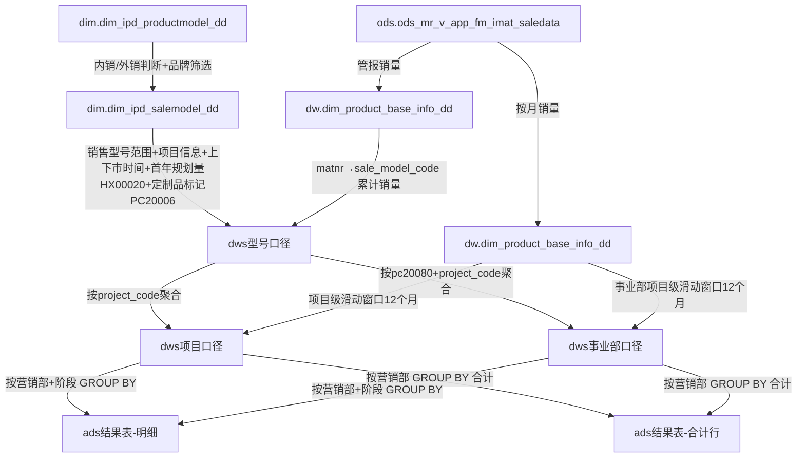

# 血缘关系文档 - 企划命中率（央空内销/日立）

## 基本信息
- **需求ID**: 003-qihua-hit-rate
- **血缘版本**: 3.9
- **生成日期**: 2026-04-24
- **最后更新**: 2026-06-18
- **状态**: 活跃

## 数据流转概览
```
第一段：型号口径（基础数据）
  dim.dim_ipd_salemodel_dd (销售型号范围、项目信息、归属营销部、上下市时间、停止下单时间PG00026、首年规划量HX00020、定制品标记PC20006、生命周期状态PG00057)
  + dim.dim_ipd_productmodel_dd (产品公司筛选PG00015='日立')
  + ods.ods_mr_v_app_fm_imat_saledata → dw.dim_product_base_info_dd (实际累计销量 + 近12个月销量)
       ↓
  dws.dws_ipd_ipm_qihua_hit_detail_dd (data_type='型号口径')

第二段：项目口径（阶段判定与达标判断）
  dws.dws_ipd_ipm_qihua_hit_detail_dd (data_type='型号口径', 过滤stop_production_date IS NULL即只取未停产型号) → 按project_code聚合
  + ods.ods_mr_v_app_fm_imat_saledata → dw.dim_product_base_info_dd (项目级按月销量，滑动窗口)
       ↓
  dws.dws_ipd_ipm_qihua_hit_detail_dd (data_type='项目口径')

第三段：事业部口径（按事业部+项目聚合，逻辑与第二段完全一致）
  dws.dws_ipd_ipm_qihua_hit_detail_dd (data_type='型号口径') → 按pc20080+project_code聚合
  + ods.ods_mr_v_app_fm_imat_saledata → dw.dim_product_base_info_dd (事业部项目级按月销量，滑动窗口)
       ↓
  dws.dws_ipd_ipm_qihua_hit_detail_dd (data_type='事业部口径')

  [项目口径 + 事业部项目口径]
       ↓
  ads.ads_ipd_ipm_qihua_hit_result_dd
    ├── 按营销部+阶段维度：统计不达标项目数/SKU数/达标率（stage>=1，仅is_in_hongheibang='Y'的阶段1-4进入汇总）
    └── 按营销部合计行：汇总所有阶段不达标合计（stage=99, stage_label='不达标合计'）
```

## 血缘关系图


## 详细血缘关系

### 1. 源表（输入）
| 表名 | 数据库 | 用途 |
|------|--------|------|
| ods_mr_v_app_fm_imat_saledata | ods | 管报实际销量（matnr, yearmonth, sale_qty） |

### 2. 维度表（关联）
| 表名 | 数据库 | JOIN字段 | 用途 |
|------|--------|----------|------|
| dim_ipd_salemodel_dd | dim | — | 销售型号范围、项目编码/名称、归属营销部、上下市时间（PG00025/PG00027/PG00026）、首年规划量（HX00020）、定制品标记（PC20006）、生命周期状态（PG00057）、委外工厂（PC00025）、模块组合（HX00379） |
| dim_ipd_productmodel_dd | dim | salemodel.PRODUCTMODEL_ID = productmodel.ID | 产品公司筛选（PG00015='日立'） |
| dim_product_base_info_dd | dw | ods管报.matnr = MDG.product_code | 物料→销售型号编码映射（sale_model_code） |

### 3. 目标表（输出）
| 表名 | 数据库 | 用途 |
|------|--------|------|
| dws_ipd_ipm_qihua_hit_detail_dd | dws | 企划命中率明细（型号口径 + 项目口径） |
| ads_ipd_ipm_qihua_hit_result_dd | ads | 企划命中率汇总结果（按营销部+阶段维度） |

### 4. 字段级血缘

#### 第一段：型号口径
| 源字段 | 源表 | 目标字段 | 目标表 | 转换逻辑 |
|--------|------|----------|--------|----------|
| PG00068 | dim_ipd_salemodel_dd | salemodel_code | dws型号口径 | 直接映射 |
| PG00061 | dim_ipd_salemodel_dd | salemodel_name | dws型号口径 | 直接映射 |
| project_code | dim_ipd_salemodel_dd | project_code | dws型号口径 | 直接映射 |
| project_name | dim_ipd_salemodel_dd | project_name | dws型号口径 | 直接映射 |
| PC20080 | dim_ipd_salemodel_dd | pc20080 | dws型号口径 | 直接映射 |
| PG00002/PG00003/PG00004 | dim_ipd_salemodel_dd | product_big/mid/sml | dws型号口径 | 直接映射 |
| PG00069 | dim_ipd_salemodel_dd | sale_brand | dws型号口径 | 直接映射 |
| PG00025 | dim_ipd_salemodel_dd | listing_date | dws型号口径 | 本月上市的置NULL |
| PG00027 | dim_ipd_salemodel_dd | stop_production_date | dws型号口径 | 本月停产的置NULL |
| PG00026 | dim_ipd_salemodel_dd | stop_order_date | dws型号口径 | 本月停止下单的置NULL |
| PG00025 | dim_ipd_salemodel_dd | shangshi_month | dws型号口径 | (当前年-上市年)×12+(当前月-上市月) |
| sale_qty | ods管报 → MDG.sale_model_code | cum_sales_qty | dws型号口径 | SUM(sale_qty) 按sale_model_code累计，截止到统计月 |
| sale_qty | ods管报 → MDG.sale_model_code | recent_12m_qty | dws型号口径 | SUM(sale_qty) 按sale_model_code，统计月前12个月窗口 |
| HX00020, PC20006 | dim_ipd_salemodel_dd | plan_first_year_qty | dws型号口径 | CASE WHEN PC20006='定制产品' THEN 0 ELSE COALESCE(HX00020, 0) END；定制品默认为0，标准品正常取HX00020 |
| stop_production_date | dim_ipd_salemodel_dd | is_stopped | dws型号口径 | 非NULL则'Y'，否则'N' |
| stop_order_date | dim_ipd_salemodel_dd | is_stop_order | dws型号口径 | 非NULL则'Y'，否则'N' |
| PG00057 | dim_ipd_salemodel_dd | lifecycle_status | dws型号口径 | 直接映射 |

#### 第二段：项目口径
| 源字段 | 源表 | 目标字段 | 目标表 | 转换逻辑 |
|--------|------|----------|--------|----------|
| project_code | dws型号口径 | project_code | dws项目口径 | GROUP BY聚合 |
| project_name | dws型号口径 | project_name | dws项目口径 | GROUP BY聚合 |
| salemodel_code | dws型号口径 | sku_count | dws项目口径 | COUNT(DISTINCT salemodel_code) |
| pc20080 | dws型号口径 | pc20080 | dws项目口径 | GROUP_CONCAT(DISTINCT pc20080, ',') |
| listing_date | dws型号口径 | listing_date | dws项目口径 | MIN(listing_date) 项目下最早上市时间 |
| stop_production_date | dws型号口径 | stop_production_date | dws项目口径 | 所有SKU都停产才算停产：COUNT(NULL停产)=0时取MAX，否则NULL |
| stop_order_date | dws型号口径 | stop_order_date | dws项目口径 | 所有SKU都停止下单才算：COUNT(NULL停下单)=0时取MAX，否则NULL |
| listing_date | dws型号口径 | shangshi_month | dws项目口径 | (当前年-MIN上市年)×12+(当前月-MIN上市月) |
| cum_sales_qty | dws型号口径 | cum_sales_qty | dws项目口径 | SUM(cum_sales_qty) 项目级汇总 |
| plan_first_year_qty | dws型号口径 | plan_first_year_qty | dws项目口径 | SUM(plan_first_year_qty) 项目级汇总 |
| sale_qty | ods管报 → MDG → 项目级按月 | max_rolling_12m_qty | dws项目口径 | 滑动窗口12个月最大销量（项目级）；先通过rolling_12m_detail按窗口偏移量SUM得到每个窗口销量，再通过rolling_12m取MAX(window_sum)，过滤window_sum>0 |
| sale_qty | ods管报 → MDG → 项目级按月 | recent_12m_qty | dws项目口径 | 近12个月固定窗口销量（阶段5-7使用） |
| cum_sales_qty, max_rolling_12m_qty, plan_first_year_qty, shangshi_month | dws项目口径 | sales_progress | dws项目口径 | 阶段1: cum/plan; 阶段2-4,42: max_rolling/plan; 阶段43: cum/(plan×月/12) |
| shangshi_month | dws项目口径 | time_progress | dws项目口径 | 上市1-18个月: shangshi_month/18.0 |
| shangshi_month, stop_production_date | dws项目口径 | stage | dws项目口径 | 7阶段判定（含stage 42/43停产特殊处理 + stage 7停止下单） |
| shangshi_month, stop_production_date | dws项目口径 | stage_label | dws项目口径 | 阶段中文标签 |
| cum_sales_qty, max_rolling_12m_qty, recent_12m_qty, plan_first_year_qty, shangshi_month, stop_production_date, stop_order_date | dws项目口径 | is_hit | dws项目口径 | 按7阶段规则判定达标Y/N（阶段5-7门槛=0，全部达标） |
| shangshi_month, stop_production_date | dws项目口径 | hit_type | dws项目口径 | 达标类型文本标签 |
| stage | dws项目口径 | is_in_hongheibang | dws项目口径 | 阶段1-4(含42/43)='Y'，阶段5-7='N' |
| stage | dws项目口径 | is_kaohe | dws项目口径 | 阶段4/42/43='Y'，其余='N' |

#### 第三段：事业部口径
> 与第二段逻辑完全一致，唯一差异：GROUP BY增加pc20080维度（事业部级别独立聚合）

| 源字段 | 源表 | 目标字段 | 目标表 | 转换逻辑 |
|--------|------|----------|--------|----------|
| project_code | dws型号口径 | project_code | dws事业部项目口径 | GROUP BY聚合（含pc20080维度） |
| project_name | dws型号口径 | project_name | dws事业部项目口径 | GROUP BY聚合（含pc20080维度） |
| pc20080 | dws型号口径 | pc20080 | dws事业部项目口径 | GROUP BY维度（单个事业部，不合并） |
| salemodel_code | dws型号口径 | sku_count | dws事业部项目口径 | COUNT(DISTINCT salemodel_code) 按事业部+项目 |
| listing_date | dws型号口径 | listing_date | dws事业部项目口径 | MIN(listing_date) 事业部项目下最早上市时间 |
| stop_production_date | dws型号口径 | stop_production_date | dws事业部项目口径 | 该事业部下所有SKU都停产才算停产 |
| stop_order_date | dws型号口径 | stop_order_date | dws事业部项目口径 | 该事业部下所有SKU都停止下单才算 |
| listing_date | dws型号口径 | shangshi_month | dws事业部项目口径 | (当前年-MIN上市年)×12+(当前月-MIN上市月) |
| cum_sales_qty | dws型号口径 | cum_sales_qty | dws事业部项目口径 | SUM(cum_sales_qty) 事业部项目级汇总 |
| plan_first_year_qty | dws型号口径 | plan_first_year_qty | dws事业部项目口径 | SUM(plan_first_year_qty) 事业部项目级汇总 |
| sale_qty | ods管报 → MDG → 事业部项目级按月 | max_rolling_12m_qty | dws事业部项目口径 | 滑动窗口12个月最大销量（按事业部+项目分组）；rolling_12m LEFT JOIN增加pb.pc20080=pms.pc20080条件 |
| sale_qty | ods管报 → MDG → 事业部项目级按月 | recent_12m_qty | dws事业部项目口径 | 近12个月固定窗口销量（阶段5-7使用，按事业部+项目分组） |
| cum_sales_qty, max_rolling_12m_qty, plan_first_year_qty, shangshi_month | dws事业部项目口径 | sales_progress | dws事业部项目口径 | 阶段1: cum/plan; 阶段2-4,42: max_rolling/plan; 阶段43: cum/(plan×月/12)（同第二段） |
| shangshi_month | dws事业部项目口径 | time_progress | dws事业部项目口径 | 上市1-18个月: shangshi_month/18.0（同第二段） |
| shangshi_month, stop_production_date | dws事业部项目口径 | stage | dws事业部项目口径 | 7阶段判定（同第二段） |
| shangshi_month, stop_production_date | dws事业部项目口径 | stage_label | dws事业部项目口径 | 阶段中文标签（同第二段） |
| cum_sales_qty, max_rolling_12m_qty, recent_12m_qty, plan_first_year_qty, shangshi_month, stop_production_date, stop_order_date | dws事业部项目口径 | is_hit | dws事业部项目口径 | 按7阶段规则判定达标Y/N（同第二段） |
| shangshi_month, stop_production_date | dws事业部项目口径 | hit_type | dws事业部项目口径 | 达标类型文本标签（同第二段） |

### 5. ADS层血缘（ads_ipd_ipm_qihua_hit_result_dd）

#### 5.1 按营销部+阶段明细（stage=1~4，含4的停产子类型）
| 源字段 | 源表 | 目标字段 | 目标表 | 转换逻辑 |
|--------|------|----------|--------|----------|
| dt_month | dws项目口径 | dt_month | ads结果表 | 直接映射 |
| pc20080 | dws项目口径 | pc20080 | ads结果表 | GROUP BY维度 |
| stage | dws项目口径 | stage | ads结果表 | GROUP BY维度（过滤stage>=1） |
| stage_label | dws项目口径 | stage_label | ads结果表 | GROUP BY维度 |
| hit_type | dws项目口径 | hit_type | ads结果表 | GROUP BY维度 |
| project_code | dws项目口径 | total_project_cnt | ads结果表 | COUNT(DISTINCT project_code) |
| sku_count | dws项目口径 | total_sku_cnt | ads结果表 | SUM(sku_count) |
| project_code, is_hit | dws项目口径 | fail_project_cnt | ads结果表 | COUNT(DISTINCT CASE WHEN is_hit='N') |
| sku_count, is_hit | dws项目口径 | fail_sku_cnt | ads结果表 | SUM(CASE WHEN is_hit='N' THEN sku_count ELSE 0) |
| fail_project_cnt, total_project_cnt | ads结果表 | hit_rate | ads结果表 | 1 - fail/NULLIF(total, 0) |

#### 5.2 按营销部合计行（stage=99, '不达标合计'）
| 源字段 | 源表 | 目标字段 | 目标表 | 转换逻辑 |
|--------|------|----------|--------|----------|
| dt_month | dws项目口径 | dt_month | ads结果表 | 直接映射 |
| pc20080 | dws项目口径 | pc20080 | ads结果表 | GROUP BY维度（仅按营销部汇总，不分阶段） |
| — | 常量 | stage | ads结果表 | 固定值 99 |
| — | 常量 | stage_label | ads结果表 | 固定值 '不达标合计' |
| — | 常量 | hit_type | ads结果表 | 固定值 '合计' |
| project_code | dws项目口径 | total_project_cnt | ads结果表 | COUNT(DISTINCT project_code)，跨所有阶段 |
| sku_count | dws项目口径 | total_sku_cnt | ads结果表 | SUM(sku_count)，跨所有阶段 |
| project_code, is_hit | dws项目口径 | fail_project_cnt | ads结果表 | COUNT(DISTINCT CASE WHEN is_hit='N')，跨所有阶段 |
| sku_count, is_hit | dws项目口径 | fail_sku_cnt | ads结果表 | SUM(CASE WHEN is_hit='N' THEN sku_count ELSE 0)，跨所有阶段 |
| fail_project_cnt, total_project_cnt | ads结果表 | hit_rate | ads结果表 | 1 - fail/NULLIF(total, 0)，跨所有阶段 |

### 6. 目标表DDL摘要

#### DWS层：dws.dws_ipd_ipm_qihua_hit_detail_dd
| 字段 | 类型 | 说明 |
|------|------|------|
| dt_month | VARCHAR(6) | 统计月份（YYYYMM格式） |
| data_type | VARCHAR(20) | 数据类型（型号口径/项目口径/事业部项目口径） |
| salemodel_code | VARCHAR(300) | 销售型号编码（型号口径使用） |
| salemodel_name | VARCHAR(300) | 销售型号名称（型号口径使用） |
| project_code | VARCHAR(300) | 项目编码 |
| project_name | VARCHAR(300) | 项目名称 |
| sku_count | INT | 项目下SKU数量（项目口径使用） |
| pc20080 | VARCHAR(1000) | 归属营销部（项目口径为去重合并文本） |
| product_big | VARCHAR(200) | 产品大类（型号口径使用） |
| product_mid | VARCHAR(200) | 产品中类（型号口径使用） |
| product_sml | VARCHAR(200) | 产品小类（型号口径使用） |
| sale_brand | VARCHAR(200) | 销售品牌（型号口径使用） |
| listing_date | DATETIMEV2(0) | 上市时间 |
| stop_production_date | DATETIMEV2(0) | 停产时间（PG00027） |
| stop_order_date | DATETIMEV2(0) | 停止下单时间（PG00026） |
| shangshi_month | INT | 上市月份数 |
| cum_sales_qty | DECIMALV3(20,4) | 累计销量 |
| recent_12m_qty | DECIMALV3(20,4) | 近12个月销量（阶段5-7使用） |
| max_rolling_12m_qty | DECIMALV3(20,4) | 累计连续12个月最大销量（项目口径使用） |
| plan_first_year_qty | DECIMALV3(20,4) | 首年规划量（HX00020） |
| sales_progress | DECIMALV3(10,4) | 销量进度（项目口径使用） |
| time_progress | DECIMALV3(10,4) | 时间进度（项目口径使用） |
| stage | INT | 阶段（1-7，含42/43停产子类型，项目口径使用） |
| stage_label | VARCHAR(50) | 阶段标签（项目口径使用） |
| is_hit | VARCHAR(2) | 是否达标（Y/N，项目口径使用） |
| hit_type | VARCHAR(50) | 达标类型（项目口径使用） |
| is_stopped | VARCHAR(2) | 是否停产（Y/N） |
| is_stop_order | VARCHAR(2) | 是否停止下单（Y/N） |
| lifecycle_status | VARCHAR(200) | 销售型号生命周期状态（PG00057，型号口径使用） |
| is_in_hongheibang | VARCHAR(2) | 是否上红黑榜（Y=阶段1-4，N=阶段5-7） |
| is_kaohe | VARCHAR(2) | 是否考核（Y=阶段4/42/43，N=其余） |
| load_dt | DATETIMEV2(0) | 加载时间 |

分区：PARTITION BY RANGE(dt_month)，动态分区（-24~+3月），HASH(dt_month) BUCKETS 4，replication_num=3

#### ADS层：ads.ads_ipd_ipm_qihua_hit_result_dd
| 字段 | 类型 | 说明 |
|------|------|------|
| dt_month | VARCHAR(6) | 统计月份（YYYYMM格式） |
| pc20080 | VARCHAR(1000) | 归属营销部 |
| stage | INT | 阶段（1-4为各阶段，含4的停产子类型，99为不达标合计） |
| stage_label | VARCHAR(50) | 阶段标签（stage=99时为"不达标合计"） |
| hit_type | VARCHAR(50) | 达标类型（stage=99时为"合计"） |
| total_project_cnt | INT | 该阶段/营销部总项目数 |
| total_sku_cnt | INT | 该阶段/营销部总SKU数 |
| fail_project_cnt | INT | 不达标项目数 |
| fail_sku_cnt | INT | 不达标SKU数 |
| hit_rate | DECIMALV3(10,4) | 达标率（1 - 不达标项目数/总项目数） |
| load_dt | DATETIMEV2(0) | 加载时间 |

分区：PARTITION BY RANGE(dt_month)，动态分区（-24~+3月），HASH(dt_month) BUCKETS 4，replication_num=3

### 7. 影响分析

#### 正向追溯（从源到目标）
- `ods.ods_mr_v_app_fm_imat_saledata` → `dw.dim_product_base_info_dd`(MDG映射) → `dws型号口径.cum_sales_qty` → `dws项目口径.cum_sales_qty`
- `ods.ods_mr_v_app_fm_imat_saledata` → `dw.dim_product_base_info_dd`(MDG映射) → 项目级按月销量 → `dws项目口径.max_rolling_12m_qty`
- `ods.ods_mr_v_app_fm_imat_saledata` → `dw.dim_product_base_info_dd`(MDG映射) → `dws型号口径.cum_sales_qty` → `dws事业部项目口径.cum_sales_qty`
- `ods.ods_mr_v_app_fm_imat_saledata` → `dw.dim_product_base_info_dd`(MDG映射) → 事业部项目级按月销量 → `dws事业部项目口径.max_rolling_12m_qty`
- `dim.dim_ipd_salemodel_dd.HX00020` + `dim.dim_ipd_salemodel_dd.PC20006` → `dws型号口径.plan_first_year_qty`（定制品=0，标准品取HX00020） → `dws项目口径.plan_first_year_qty`
- `dim.dim_ipd_salemodel_dd.HX00020` + `dim.dim_ipd_salemodel_dd.PC20006` → `dws型号口径.plan_first_year_qty`（定制品=0，标准品取HX00020） → `dws事业部项目口径.plan_first_year_qty`
- `dim.dim_ipd_salemodel_dd` → `dws型号口径`(基础属性) → `dws项目口径`(聚合) → 阶段判定 + 达标判断
- `dim.dim_ipd_salemodel_dd` → `dws型号口径`(基础属性) → `dws事业部项目口径`(按事业部+项目聚合) → 阶段判定 + 达标判断
- `dws项目口径`(is_hit, project_code, sku_count, pc20080, stage) → `ads结果表`(按营销部+阶段汇总) → hit_rate
- `dws项目口径`(is_hit, project_code, sku_count, pc20080) → `ads结果表`(按营销部合计行, stage=99)
- `dws事业部口径`(is_hit, project_code, sku_count, pc20080, stage) → `ads结果表`（可选，视ADS层脚本引用而定）

#### 反向影响（从目标到源）
- `ads结果表.hit_rate` ← fail_project_cnt/total_project_cnt ← `dws项目口径.is_hit` + `dws项目口径.project_code`
- `ads结果表.fail_sku_cnt` ← `dws项目口径.sku_count` + `dws项目口径.is_hit`
- `dws项目口径.is_hit` ← stage判定 ← shangshi_month ← `dim.dim_ipd_salemodel_dd.PG00025`
- `dws项目口径.is_hit` ← cum_sales_qty/max_rolling_12m_qty ← `ods.ods_mr_v_app_fm_imat_saledata.sale_qty`
- `dws项目口径.is_hit` ← plan_first_year_qty ← `dim.dim_ipd_salemodel_dd.HX00020` + `dim.dim_ipd_salemodel_dd.PC20006`（定制品=0）
- `dws项目口径.max_rolling_12m_qty` ← 项目级按月销量 ← `ods管报` + `MDG` + `dws型号口径.salemodel_code→project_code`

## 核心设计变更说明（v2.0）
- 型号口径简化为纯基础数据输出，不再做阶段判定和达标判断
- 滑动窗口12个月最大销量改为在项目口径级别计算（而非型号级别汇总）
- 项目口径从型号口径聚合后，独立计算项目级按月销量并做滑动窗口
- 所有阶段判定和达标判断统一在项目口径级别完成

## 核心设计变更说明（v2.1）
- 滑动窗口计算拆分为两步CTE：`rolling_12m_detail`（按窗口偏移量计算每个窗口的SUM）+ `rolling_12m`（取MAX并过滤window_sum>0）
- 原单步CTE中的HAVING过滤改为独立CTE的WHERE过滤，逻辑等价但结构更清晰、可调试性更强

## 核心设计变更说明（v2.2）
- ADS层脚本完善：新增"不达标合计行"（stage=99），按营销部汇总所有阶段的不达标项目数/SKU数/达标率
- ADS层血缘拆分为两部分：5.1 按营销部+阶段明细、5.2 按营销部合计行
- 影响分析补充ADS层正向追溯和反向影响路径

## 核心设计变更说明（v3.0）
- 新增"目标表DDL摘要"章节（第6节），记录DWS和ADS两张目标表的完整字段定义、数据类型和分区策略
- DDL来源：`create_tables.sql`，与ETL脚本字段完全对齐
- 血缘版本升至3.0

## 核心设计变更说明（v3.1）
- DDL数据类型升级为Doris原生类型：`DATE` → `DATETIMEV2(0)`（listing_date、stop_production_date、load_dt），`DECIMAL` → `DECIMALV3`（cum_sales_qty、max_rolling_12m_qty、plan_first_year_qty、sales_progress、time_progress、hit_rate）
- DWS和ADS两张目标表DDL摘要同步更新

## 核心设计变更说明（v3.2）
- 型号口径sale_model CTE外销品牌筛选范围扩展：PG00069 IN ('Hisense') → IN ('Hisense','HITACHI','YORK')

## 核心设计变更说明（v3.3）
- 新增第三段"事业部口径"（data_type='事业部项目口径'）
- 逻辑与第二段（项目口径）完全一致，唯一差异：GROUP BY增加pc20080维度
- project_base CTE按 project_code + project_name + pc20080 聚合（第二段仅按project_code + project_name）
- project_monthly_sales 和 rolling_12m 按事业部+项目分组计算
- 最终JOIN条件增加 pb.pc20080 = r12.pc20080
- 血缘关系图新增事业部项目口径节点及其依赖路径

## 核心设计变更说明（v3.4）
- 第三段注释从"事业部项目口径"简化为"事业部口径"，与SQL脚本保持一致
- data_type字段值仍为'事业部项目口径'不变（仅影响注释和文档描述）

## 核心设计变更说明（v3.5）
- 型号口径plan_first_year_qty字段增加定制品判断：PC20006='定制产品'时首年规划量强制为0，标准品保持取HX00020
- 影响范围：型号口径→项目口径→事业部口径的plan_first_year_qty均受影响（通过SUM聚合传递）
- 业务含义：定制品不纳入规划量统计，避免影响企划命中率判定

## 核心设计变更说明（v3.6）
- 项目口径（第二段）project_base CTE新增过滤条件：`stop_production_date IS NULL`（只取未停产的型号参与项目聚合）
- 影响范围：项目口径的project_base数据源缩小，停产型号不再参与项目级指标计算（cum_sales_qty、plan_first_year_qty、sku_count等均排除停产型号贡献）
- 业务含义：项目口径聚合时只统计在产型号的数据，已停产型号不纳入项目达标判定的基数

## 变更记录
| 变更日期 | 变更类型 | 变更描述 | 变更人 |
|----------|----------|----------|--------|
| 2026-04-24 | 新增 | 初始血缘关系 | ETL智能辅助工具 |
| 2026-04-24 | 重构 | 型号口径简化为基础数据；滑动窗口和阶段判定移至项目口径级别 | ETL智能辅助工具 |
| 2026-04-24 | 优化 | 滑动窗口CTE拆分为rolling_12m_detail+rolling_12m两步，HAVING改为WHERE过滤 | ETL智能辅助工具 |
| 2026-04-24 | 新增 | ADS汇总层脚本开发完成，按营销部+阶段维度统计不达标项目数/SKU数/达标率 | ETL智能辅助工具 |
| 2026-04-24 | 变更 | 首年规划量改为从dim_ipd_salemodel_dd.HX00020直接取值，移除dwd_bp_lx依赖 | ETL智能辅助工具 |
| 2026-04-24 | 修复 | 型号口径sale_model CTE补充plan_first_year_qty字段 | ETL智能辅助工具 |
| 2026-04-24 | 优化 | DWS脚本列名添加注释，增强可读性 | ETL智能辅助工具 |
| 2026-04-24 | 修复 | GROUP_CONCAT语法修正，移除不支持的ORDER BY和SEPARATOR | ETL智能辅助工具 |
| 2026-04-24 | 修复 | 项目停产逻辑修正：所有SKU都停产才算项目停产 | ETL智能辅助工具 |
| 2026-04-24 | 修复 | DWS项目口径stop_production_date字段SQL实现同步 | ETL智能辅助工具 |
| 2026-04-24 | 新增 | v3.0：新增目标表DDL摘要章节，记录DWS/ADS完整字段定义和分区策略 | ETL智能辅助工具 |
| 2026-04-24 | 变更 | v3.1：DDL数据类型升级为Doris原生类型（DATE→DATETIMEV2(0)，DECIMAL→DECIMALV3），DWS/ADS表同步更新 | ETL智能辅助工具 |
| 2026-06-08 | 变更 | 型号口径sale_model CTE外销品牌筛选范围扩展：PG00069 IN ('Hisense') → IN ('Hisense','HITACHI','YORK')，与内销品牌范围对齐 | 用户 |
| 2026-06-08 | 新增 | v3.3：新增第三段"事业部口径"（从型号按pc20080+project_code聚合，逻辑与项目口径一致，增加事业部维度独立统计） | 用户 |
| 2026-06-08 | 变更 | v3.4：第三段注释从"事业部项目口径"简化为"事业部口径"，data_type值不变，血缘文档同步更新描述 | 用户 |
| 2026-06-08 | 变更 | v3.5：型号口径plan_first_year_qty增加定制品判断（PC20006='定制产品'时为0），血缘字段级关系同步更新 | 用户 |
| 2026-06-15 | 变更 | v3.6：项目口径project_base CTE新增stop_production_date IS NULL过滤，只取未停产型号参与项目聚合 | 用户 |
| 2026-06-16 | 变更 | v3.7：ADS脚本注释补充is_in_hongheibang='Y'筛选说明，明确仅红黑榜阶段（1-4）进入ADS汇总；数据流转概览同步更新 | 用户 |
| 2026-06-18 | 变更 | v3.8：ADS脚本stage注释修正（"1-6"→"1-4，含4的停产子类型"），与is_in_hongheibang='Y'筛选逻辑一致；血缘DDL摘要和ADS血缘章节同步更新 | 用户 |
| 2026-06-18 | 变更 | v3.9：正式版全量血缘同步——新增字段（stop_order_date、is_stop_order、recent_12m_qty、lifecycle_status、is_in_hongheibang、is_kaohe）；阶段从6阶段更新为7阶段（含stage 7停止下单+42/43停产子类型）；data_type='事业部项目口径'更正为'事业部口径'；维度表筛选条件同步正式版（产品公司='日立'+7小类+9营销部+排除委外+排除模块组合） | 用户 |
