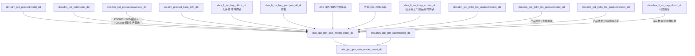
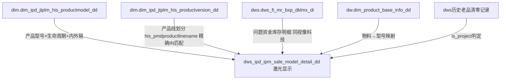
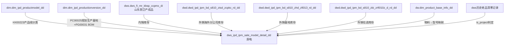
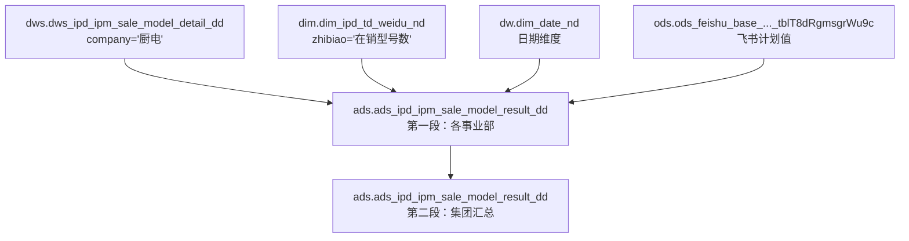
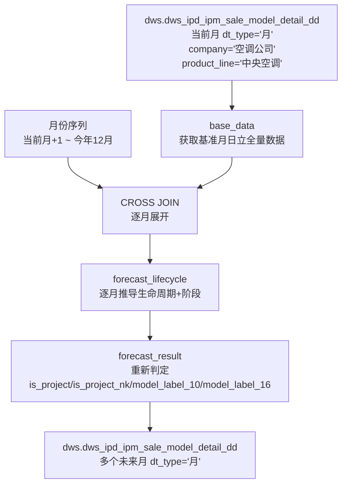

# 血缘关系文档 - 在销型号数

## 基本信息
- **需求ID**: 004-sale-model-count
- **血缘版本**: 2.0
- **生成日期**: 2026-04-29
- **最后更新**: 2026-07-01
- **状态**: 活跃

## 数据流转概览
```
[DWS层] dws_ipd_ipm_sale_model_detail_dd
  ← dim.dim_ipd_productmodel_dd (产品型号基础信息、生命周期状态)
  ← dim.dim_ipd_productionversion_dd (生产版本→BOM编码+规划生产基地)
  ← dim.dim_ipd_salemodel_dd (日立销售型号信息)
  ← dim.dim_ipd_jtplm_his_productversion_dd (视像科技生产版本)
  ← dim.dim_ipd_jtplm_his_productmodel_dd (激光显示产品型号，精确IN匹配产品线)
  ← dw.dim_product_base_info_dd (MDG桥梁：物料→型号映射)
  ← 库存数据（多源：冰箱/空调/海外/基地/在途/OEM/厨电/激光问题资金）
         ↓
[ADS层] ads_ipd_ipm_sale_model_result_dd
  ← dws.dws_ipd_ipm_sale_model_detail_dd (明细汇总)
  ← dws.dws_ipd_ipm_salemodelid_dd (销售型号口径)
```

> **厨电事业部**：DWS层已正式合入主脚本（2026-05-20），位于冰冷洗/空调/日立/视像科技分支之后。
> **厨电ADS层**：已正式应用并同步到主脚本（2026-05-22确认），在 ads_ipd_ipm_sale_model_result_dd.sql 中所有6个修改点均已生效：DELETE/INSERT/JOIN条件包含'厨电'，集团汇总CASE WHEN包含厨电事业部。
> **激光显示**：DWS层草稿阶段（2026-05-28），文件 dws_ipd_ipm_sale_model_detail_dd_jiguang_draft.sql。产品线通过精确IN匹配判定（非LIKE），库存数据使用问题资金（dws_fi_mr_bxp_dklmx_di，同视像科技逻辑）。

## 血缘关系图


## 核心关联路径

### 冰冷洗在销型号
1. `dim.dim_ipd_productmodel_dd` → 产品型号基础信息 + 生命周期判定（通过PG00002/PG00003/PG00004分类）
2. 库存数据（大库龄+寄售+海外+基地+在途）→ 库存清零判定
3. 合并型号信息+库存 → 在销/老品/老品清零/未上市 分类

### 空调在销型号
1. `dim.dim_ipd_productmodel_dd` → 空调产品型号 + 内部组织分类（kt_nbzz）
2. 空调自有库存 + OEM库存 → 库存清零判定
3. 轻商单元式内外机有整机时去重

### 日立中央空调
1. `dim.dim_ipd_salemodel_dd` → 销售型号口径（PG00068销售型号编码）
2. 排除非标准品、委外工厂（1000-海信日立委外工厂）、模块组合
3. `is_project_nk`（内控口径）：在集团口径基础上放宽范围，用于内控保护期判定
4. `dw.dim_product_base_info_dd` → 物料编码（通过sale_model_code关联，GROUP_CONCAT合并，限定create_company='RILI'）
5. 产品小类逻辑：空气调节类配件中类不分小类（CASE WHEN PG00003='空气调节类配件' THEN '空气调节类配件' ELSE PG00004）
6. 新增明细字段：HX00327（所有者）、PC20018（非标对应原型机）、PG00009（产品系列）、PG00024（规划停止下单时间）、PC10141（规划停止生产时间），均来源于dim.dim_ipd_salemodel_dd

### 视像科技
1. `dim.dim_ipd_jtplm_his_productversion_dd` → 生产版本信息
2. 内销/外销分别处理

### 激光显示（草稿阶段）
1. `dim.dim_ipd_jtplm_his_productmodel_dd` → 产品型号基础信息（产品公司='激光显示'，产品小类 IN 激光电视/家用投影/商用投影）
2. `dim.dim_ipd_jtplm_his_productversion_dd` → 产品线划分（通过 his_pmdproductlinename 精确IN匹配判定激光家用/激光商用）
3. 库存数据：`dws.dws_fi_mr_bxp_dklmx_di`（问题资金库存明细，同视像科技逻辑）+ `dw.dim_product_base_info_dd`（物料→型号映射）
4. 库存清零判定：退市+库存=0→老品清零（同冰箱逻辑）
5. is_project判定：指标范围外→Y，未上市/老品清零→Y，商用投影→Y，OEM品牌→Y，历史已清零→Y，其余→N

### 厨电（已合入主脚本）

**核心逻辑**：
1. 产品线通过 HX00223 字段识别（烟机/灶具/洗碗机/电热水器/燃气热水器/烤箱）
2. 内销指标范围：剔除空壳机（型号名含"空壳机"）、吸油烟机配件（中类）、非Hisense品牌
3. 外销指标范围：剔除散件(/SKD结尾)、样机(YJ结尾)
4. 内销库存来源：山东厨卫产成品明细（dws_fi_mr_kbsp_ccpmx_di），厨电独立库存源，load_dt取次日
5. 外销库存来源：海外分公司库存（6A家电-炉灶具/6B家电-洗碗机/65家电-小家电）+ 基地库存 + 在途库存，产品线统一写'厨电'占位
6. 规划生产基地：通过 `dim.dim_ipd_productionversion_dd.PC00025` 按产品型号 GROUP_CONCAT 合并去重
7. 库存清零判定：退市+库存=0→老品清零（同冰箱逻辑）
8. is_project判定：指标范围外→Y，未上市/老品清零/其他→Y，历史已清零→Y，其余→N

### 激光显示（草稿阶段）

**核心逻辑**：
1. 产品线通过 `dim.dim_ipd_jtplm_his_productversion_dd.his_pmdproductlinename` 字段精确IN匹配识别：
   - 激光家用：IN ('激光-内销产品线','激光-海外产品线','激光-智能投影产品线','激光-亚太产品线')
   - 激光商用：IN ('激光-商用产品线')
   - 判定方式：精确IN匹配（非LIKE）
2. 产品范围：产品公司='激光显示'，产品小类 IN ('激光电视','家用投影','商用投影')
3. 商用投影仅抓取数据不计入统计（is_zhibiaofanwei='N'）
4. OEM品牌不计入统计（is_zhibiaofanwei='N'，通过his_oembrand非空判定）
5. 库存数据：`dws.dws_fi_mr_bxp_dklmx_di`（问题资金库存明细，invstatus='正品' AND daymonth_flag='0'，同视像科技逻辑）经 `dw.dim_product_base_info_dd` 映射到产品型号
6. 库存清零判定：退市+库存=0→老品清零（同冰箱逻辑）
7. 库存清零历史判定增强：model_label_10='老品清零' OR (delisted_time IS NOT NULL AND inventory_qty=0)
8. is_project判定：指标范围外→Y，未上市/老品清零/其他→Y，历史已清零→Y，其余→N
9. 退市节点：停止下单（his_stopproductiontime），激光无退市准备节点
10. INSERT字段列表包含：dt_month, dt_type, business_division, company, product_line, in_out_sale, model, IR_act_time, delisted_time, inventory_qty, model_label_10, model_label_16, dt_day, is_project, kcql_time, shangshi_m, tuishijuece_m, tingchan_m, kcqw_m, load_dt, product_big, product_mid, product_sml, platform, productmodel, chanpindingwei, brand, productmodel__life, productline_tv

**激光显示血缘关系图**：


**激光显示源表明细**：
| 表名 | 数据库 | 用途 | 筛选条件 |
|------|--------|------|----------|
| dim_ipd_jtplm_his_productmodel_dd | dim | 产品型号基础信息（集团PLM） | his_pmdproductaffiliatedcompany='激光显示' AND his_productsmallcategories IN ('激光电视','家用投影','商用投影') |
| dim_ipd_jtplm_his_productversion_dd | dim | 生产版本（产品线划分） | his_productsmallcategories IN ('激光电视','家用投影','商用投影')，GROUP BY modelname |
| dws_ipd_ipm_sale_model_detail_dd | dws | 历史老品清零记录（自引用） | company='激光显示' AND product_line IN ('激光家用','激光商用') AND dt_type='月' AND (model_label_10='老品清零' OR (delisted_time IS NOT NULL AND inventory_qty=0)) |
| dws_fi_mr_bxp_dklmx_di | dws | 问题资金库存明细（同视像科技逻辑） | invstatus='正品' AND daymonth_flag='0' AND load_dt=cast('${GP_START_DT}' as date) |
| dim_product_base_info_dd | dw | MDG主数据（物料→型号映射，库存关联用） | product_type_code='FERT' AND delete_flag!='Y' |

**激光显示外销库存字段结构（历史参考，当前草稿已改用问题资金统一库存）**：

> 注：当前草稿版本已将库存统一改为 `dws.dws_fi_mr_bxp_dklmx_di`（问题资金，同视像科技逻辑），不再区分内外销库存。以下外销三表结构仅作为历史参考保留，如后续需要区分内外销库存时可恢复。

| 字段 | 海外分公司 | 基地 | 在途 | 说明 |
|------|-----------|------|------|------|
| matnr | ✓ | ✓ | ✓ | 物料编码 |
| werks/bukrs | werks | werks(NULL) | bukrs | 工厂/公司编码 |
| charg/bwtar | charg | charg(NULL) | bwtar | 批次/评估类型 |
| zcusmodel | ✓ | NULL | ✓ | 客户型号 |
| zmodel | ✓ | NULL | NULL | 型号 |
| zfacmodel | ✓ | NULL | ✓ | 工厂型号 |
| vtext/gtext | vtext | gtext | vtext | 产品描述 |
| kc_sum | clabs | menge | menge | 库存数量 |
| landx/zywqy | landx | zywqy | NULL | 国家/业务区域 |
| related_rd | ✓ | ✓ | ✓ | 关联RD |
| zmodel_rd | ✓ | ✓ | ✓ | 型号RD |
| quzu_rd | ✓ | ✓ | ✓ | 区组RD |
| prouductmodel_rd | ✓ | ✓ | ✓ | 产品型号RD（用于汇总） |
| salemodel_rd | ✓ | ✓ | ✓ | 销售型号RD |
| salemodelid_rd | ✓ | ✓ | ✓ | 销售型号ID RD |
| productionversion_rd | ✓ | ✓ | ✓ | 生产版本RD |

**厨电血缘关系图**：


**厨电源表明细**：
| 表名 | 数据库 | 用途 | 筛选条件 |
|------|--------|------|----------|
| dws_fi_mr_kbsp_ccpmx_di | dws | 山东厨卫产成品明细（厨电内销库存，唯一来源） | daymonth_flag='0' AND kcfl='正品' AND load_dt=次日(date_add GP_START_DT +1 day) |
| dwd_ipd_ipm_bd_s810_ztsd_zcpkc_rd_dd | dwd | 海外分公司库存（厨电外销） | vtext IN ('家电-炉灶具','家电-洗碗机','家电-小家电') AND quzu_rd IN ('国际营销','东盟区') AND zkwlb='A' AND lgort IS NOT NULL AND werks前2位<>'80' |
| dwd_ipd_ipm_bd_s810_zhd_zfi013_rd_dd | dwd | 基地库存（厨电外销） | gtext IN ('家电.炉灶具','家电.洗碗机','家电.小家电') AND quzu_rd IN ('国际营销','东盟区') |
| dwd_ipd_ipm_bd_s810_zbi_zrfi010z_d_rd_dd | dwd | 在途库存（厨电外销） | SPART_rd IN ('6A','6B','65') AND menge>=1 AND bukrs NOT IN ('8300','8320','8330','8370','8380','8390','83B0') |
| dim_ipd_productmodel_dd | dim | 产品型号基础信息 | HX00223 IN ('烟机','灶具','洗碗机','电热水器','燃气热水器','烤箱') |
| dim_ipd_productionversion_dd | dim | 生产版本（规划生产基地GROUP_CONCAT合并+BOM编码max） | PC00025 IS NOT NULL |
| dim_product_base_info_dd | dw | MDG主数据（物料→型号映射） | product_type_code='FERT' AND delete_flag!='Y' |

**厨电外销库存产品线映射**：
| 源字段值 | 映射产品线 | 来源表 | 说明 |
|----------|-----------|--------|------|
| 家电-炉灶具 / 家电.炉灶具 / SPART_rd='6A' | 厨电（统一） | 海外/基地/在途 | 统一写'厨电'占位，按prouductmodel_rd汇总 |
| 家电-洗碗机 / 家电.洗碗机 / SPART_rd='6B' | 厨电（统一） | 海外/基地/在途 | 统一写'厨电'占位，按prouductmodel_rd汇总 |
| 家电-小家电 / 家电.小家电 / SPART_rd='65' | 厨电（统一） | 海外/基地/在途 | 统一写'厨电'占位，按prouductmodel_rd汇总 |

## 详细血缘关系

### 1. 源表（输入）— 主脚本当前使用
| 表名 | 数据库 | 用途 |
|------|--------|------|
| dim_ipd_productmodel_dd | dim | 产品型号基础信息（生命周期、上市时间、品牌、产品分类） |
| dim_ipd_salemodel_dd | dim | 销售型号基础信息（日立口径） |
| dim_ipd_productionversion_dd | dim | 生产版本信息（BOM编码 PG00031） |
| dim_ipd_jtplm_his_productversion_dd | dim | 视像科技生产版本 |
| dim_product_base_info_dd | dw | MDG产品主数据（物料→型号映射桥梁） |
| dws_fi_mr_bxp_dklmx_di | dws | 大库龄明细（正品、日报；冰冷内销） |
| dws_fi_mr_bxp_yxccpmx_all_di | dws | 营销产成品明细（寄售-线上/线下；冰冷内销） |
| dwd_ipd_ipm_bd_s810_ztsd_zcpkc_rd_dd | dwd | 海外分公司库存（冰冷洗/空调/厨电外销） |
| dwd_ipd_ipm_bd_s810_zhd_zfi013_rd_dd | dwd | 基地库存（冰冷洗/空调/厨电外销） |
| dwd_ipd_ipm_bd_s810_zbi_zrfi010z_d_rd_dd | dwd | 在途库存（冰冷洗/空调/厨电外销） |
| dwfi_fa_tf_acp_prostockdetail | test | 空调自有库存 |
| odss900_mchb / odss900_mchbh | ods | OEM库存（空调） |

### 2. 源表（输入）— 厨电（已合入主脚本）
| 表名 | 数据库 | 用途 |
|------|--------|------|
| dws_fi_mr_kbsp_ccpmx_di | dws | 山东厨卫产成品明细（厨电内销库存，唯一来源） |

### 2.5 源表（输入）— 激光显示（草稿阶段）
| 表名 | 数据库 | 用途 |
|------|--------|------|
| dim_ipd_jtplm_his_productmodel_dd | dim | 集团PLM产品型号基础信息（激光显示产品型号+生命周期+上下市时间） |
| dim_ipd_jtplm_his_productversion_dd | dim | 集团PLM生产版本（产品线划分：his_pmdproductlinename精确IN匹配） |
| dws_ipd_ipm_sale_model_detail_dd | dws | 自引用：历史老品清零记录（company='激光显示'） |
| dws_fi_mr_bxp_dklmx_di | dws | 问题资金库存明细（invstatus='正品' AND daymonth_flag='0'，同视像科技逻辑） |
| dim_product_base_info_dd | dw | MDG主数据（物料→型号映射，库存goods_code→product_code→model_name） |

### 3. 目标表（输出）
| 表名 | 数据库 | 用途 |
|------|--------|------|
| dws_ipd_ipm_sale_model_detail_dd | dws | 在销型号明细表（按 company 区分事业部：冰冷/洗衣机/空调公司/厨电） |
| ads_ipd_ipm_sale_model_result_dd | ads | 在销型号数结果表 |

### 4. 字段级血缘（DWS层核心字段）
| 源字段 | 源表 | 目标字段 | 目标表 | 转换逻辑 |
|--------|------|----------|--------|----------|
| PG00061 | dim_ipd_productmodel_dd | model / productmodel | dws明细 | 产品型号名称，直接映射 |
| PG00029 | dim_ipd_productmodel_dd | productmodel__life | dws明细 | 生命周期状态，用于判定在产/退市 |
| PG00025 | dim_ipd_productmodel_dd | IR_act_time / act_time_ss | dws明细 | 实际上市时间 |
| PG00027 | dim_ipd_productmodel_dd | delisted_time / act_time_tzsc | dws明细 | 停止生产时间 |
| HX00501 | dim_ipd_productmodel_dd | act_time_tszb | dws明细 | 实际退市准备时间 |
| PG00026 | dim_ipd_productmodel_dd | act_time_tzxd | dws明细 | 实际停止下单时间 |
| PG00005 | dim_ipd_productmodel_dd | brand | dws明细 | 品牌名称 |
| PG00002/PG00003/PG00004 | dim_ipd_productmodel_dd | product_big/mid/sml | dws明细 | CASE WHEN分类→冰箱/冷柜/洗衣机/空调等 |
| HX00223 | dim_ipd_productmodel_dd | product_line（厨电） | dws明细 | 厨电产品线直接取值（烟机/灶具/洗碗机/电热水器/燃气热水器/烤箱） |
| PG00020 | dim_ipd_productmodel_dd | in_out_sale | dws明细 | 内销/外销标识 |
| PG00015 | dim_ipd_productmodel_dd | PG00015 | dws明细 | 产品公司 |
| PG00014 | dim_ipd_productmodel_dd | platform | dws明细 | 产品平台 |
| PG00019 | dim_ipd_productmodel_dd | chanpindingwei | dws明细 | 产品定位 |
| PG00021 | dim_ipd_productmodel_dd | plan_channel | dws明细 | 规划销售渠道 |
| PC00025 | dim_ipd_productmodel_dd | plan_base | dws明细 | 规划生产基地（冰冷洗直接取值） |
| PC00025 | dim_ipd_productionversion_dd | plan_base（厨电） | dws明细 | 规划生产基地（厨电通过GROUP_CONCAT合并去重） |
| HX00023 | dim_ipd_productmodel_dd | salesarea_big | dws明细 | 销售大区 |
| HX00024 | dim_ipd_productmodel_dd | salesarea_sml | dws明细 | 销售小区 |
| HX00226 | dim_ipd_productmodel_dd | export_method | dws明细 | 出口方式 |
| HX00026 | dim_ipd_productmodel_dd | is_biaoji | dws明细 | 是否标机 |
| HX00027 | dim_ipd_productmodel_dd | is_yangji | dws明细 | 是否样机 |
| PC10050 | dim_ipd_productmodel_dd | menlei | dws明细 | 门类 |
| PC00001 | dim_ipd_productmodel_dd | pinleixifen | dws明细 | 品类细分 |
| 库存数量 | 多源库存表 | inventory_qty | dws明细 | SUM(各渠道库存)，用于清零判定 |
| jieduan + inventory_qty | 派生 | model_label_10 | dws明细 | 在产/老品/老品清零/未上市（PUB-007规则） |
| is_zhibiaofanwei + jieduan + 上市时间 | 派生 | is_project | dws明细 | 保护期/指标范围标记（PUB-001规则） |
| PG00068 | dim_ipd_salemodel_dd | salemodel_code | dws明细(日立) | 销售型号编码（日立口径） |
| is_project_nk | 派生（dim_ipd_salemodel_dd多字段） | is_project_nk | dws明细(日立) | 内控保护期标记：在集团is_project基础上放宽营销部和品牌范围 |
| product_code | dw.dim_product_base_info_dd | matnr | dws明细(日立) | 物料编码（通过sale_model_code关联MDG，GROUP_CONCAT合并，create_company='RILI'） |
| HX00327 | dim_ipd_salemodel_dd | HX00327 | dws明细(日立) | 所有者 |
| PC20018 | dim_ipd_salemodel_dd | PC20018 | dws明细(日立) | 非标对应原型机 |
| PG00009 | dim_ipd_salemodel_dd | PG00009 | dws明细(日立) | 产品系列 |
| PG00024 | dim_ipd_salemodel_dd | PG00024 | dws明细(日立) | 规划停止下单时间 |
| PC10141 | dim_ipd_salemodel_dd | PC10141 | dws明细(日立) | 规划停止生产时间 |
| PG00031 | dim_ipd_productionversion_dd | matnr | dws明细 | BOM编码（按产品型号GROUP BY取max） |
| ID | dim_ipd_productmodel_dd | productmodel_id | dws明细 | 产品型号ID |
| wlh | dws_fi_mr_kbsp_ccpmx_di | （经MDG映射）inventory_qty | dws明细(厨电内销) | 物料号→MDG→产品型号→库存数量 |
| zzysl | dws_fi_mr_kbsp_ccpmx_di | inventory_qty | dws明细(厨电内销) | 总站用量作为库存数量 |

### 5. 字段级血缘（ADS层核心字段）
| 源字段 | 源表 | 目标字段 | 目标表 | 转换逻辑 |
|--------|------|----------|--------|----------|
| model | dws明细 | act_num | ads结果 | COUNT(DISTINCT model) WHERE is_project='N' |
| product_line | dws明细 | product_line | ads结果 | GROUP BY维度；厨电有多条产品线（烟机/灶具/洗碗机等），需生成"全部"汇总行 |
| company | dws明细 | business_division | ads结果 | GROUP BY维度；company IN ('冰冷','洗衣机','空调公司','视像科技','厨电') |
| in_out_sale | dws明细 | in_out_sale | ads结果 | GROUP BY维度；通过weidu_neiwaixiao生成"全部"汇总行 |

### 6. ADS层厨电处理逻辑（已正式应用 — 完整版）

**修改方式**：草稿已升级为完整可执行SQL（ads_ipd_ipm_sale_model_result_dd_chudian_draft.sql），包含第一段（各事业部）和第二段（集团汇总）的完整逻辑。

**已完成修改点**：
| 修改位置 | 原始条件 | 修改后条件 | 状态 |
|----------|----------|-----------|------|
| 第一段 DELETE WHERE | company IN ('冰冷','洗衣机','空调公司','视像科技','集团汇总') | company IN ('冰冷','洗衣机','空调公司','视像科技','厨电','集团汇总') | ✅ 已应用 |
| 第一段 INSERT WHERE | t1.company IN ('冰冷','洗衣机','空调公司','视像科技') | t1.company IN ('冰冷','洗衣机','空调公司','视像科技','厨电') | ✅ 已应用 |
| 第一段 weidu_product_line JOIN | t1.company IN ('冰冷','空调公司') | t1.company IN ('冰冷','空调公司','厨电') | ✅ 已应用 |
| 第二段 集团汇总 act_value WHERE | company IN ('冰冷','洗衣机','空调公司','视像科技') | company IN ('冰冷','洗衣机','空调公司','视像科技','厨电') | ✅ 已应用 |
| 第二段 集团汇总 CASE WHEN（全部口径） | 无厨电事业部 | 新增 `when business_division = '厨电事业部' then product_line = '全部' and in_out_sale = '全部'` | ✅ 已应用 |
| 第二段 集团汇总 CASE WHEN（内外销口径） | 无厨电事业部 | 新增 `when business_division = '厨电事业部' then product_line = '全部' and in_out_sale in ('内销','外销')` | ✅ 已应用 |

**ADS层厨电血缘**：


**第一段源表明细**：
| 表名 | 数据库 | CTE名称 | 用途 |
|------|--------|---------|------|
| dim_ipd_td_weidu_nd | dim | weidu_shiyebu | 维度表驱动：事业部/公司/产品线/内外销维度组合 |
| dim_date_nd | dw | dt_month_weidu | 日期维度：当年各月份 |
| dws_ipd_ipm_sale_model_detail_dd | dws | act_value | 在销型号明细（实际值来源），COUNT(DISTINCT model) WHERE is_project='N' |
| ods_feishu_base_..._tblT8dRgmsgrWu9c | ods | plan_values | 飞书多维表格：在销型号计划值 |

**第二段源表明细**：
| 表名 | 数据库 | CTE名称 | 用途 |
|------|--------|---------|------|
| ads_ipd_ipm_sale_model_result_dd | ads | act_value | 自引用：从第一段结果中按事业部汇总为集团口径 |
| ods_feishu_base_..._tblT8dRgmsgrWu9c | ods | plan_values | 飞书多维表格：集团汇总计划值（WHERE 事业部='集团汇总'） |

**汇总维度说明**：
- `weidu_neiwaixiao`：生成"全部"内外销汇总行（CROSS JOIN）
- `weidu_product_line`：厨电有多条产品线（烟机/灶具/洗碗机/电热水器/燃气热水器/烤箱），需要生成"全部"产品线汇总行
- 统计口径：COUNT(DISTINCT model) WHERE is_project='N'，与冰冷洗/空调/视像科技一致
- 完成率公式：`2 - (实际值 / 计划值)`（越少越好型指标）

**集团汇总逻辑**：
- 全部口径：各事业部取 product_line='全部' AND in_out_sale='全部' 后 SUM
- 内外销口径：各事业部取 product_line='全部/视像科技/洗衣机' AND in_out_sale IN ('内销','外销') 后按 in_out_sale GROUP BY SUM
- 厨电在集团汇总中的取数条件：`business_division = '厨电事业部' AND product_line = '全部'`

## 厨电CTE结构（已合入主脚本）
```
WITH kucun_qingwei AS (...)        -- 历史库存清零时间（从dws自身历史数据）
,productionversion_base AS (...)   -- 生产版本规划生产基地（GROUP_CONCAT合并去重）
,product_model AS (...)            -- 产品型号基础信息 + HX00223产品线判定 + 指标范围判定 + 生命周期阶段判定
,kc_nx AS (...)                    -- 内销库存（山东厨卫产成品明细，唯一来源）
,kc_wx AS (...)                    -- 外销库存（海外分公司+基地+在途，6A/6B/65）
,kc_all AS (...)                   -- 库存汇总（外销按prouductmodel_rd汇总 + 内销经MDG映射汇总）
,zx_model AS (...)                 -- 最终型号（库存清零判定：退市+库存=0→老品清零）
SELECT DISTINCT ...                -- 最终INSERT（关联历史老品清零+库存清零时间+BOM编码+规划生产基地）
```

## 激光显示CTE结构（草稿阶段）
```
WITH jiguang_productline AS (...)  -- 激光产品线映射（从dim_ipd_jtplm_his_productversion_dd，GROUP_CONCAT his_pmdproductlinename，精确IN匹配）
,kucun_qingwei AS (...)            -- 历史库存清零时间（从dws自身历史数据，company='激光显示'，含model_label_10='老品清零' OR (delisted_time IS NOT NULL AND inventory_qty=0)）
,product_model AS (...)            -- 激光产品型号基础信息（从dim_ipd_jtplm_his_productmodel_dd取，含产品线划分+指标范围判定+生命周期阶段判定）
,kc_all AS (...)                   -- 库存汇总（问题资金：dws_fi_mr_bxp_dklmx_di 正品+日报 经MDG映射到型号，同视像科技逻辑）
,zx_model AS (...)                 -- 最终型号（库存清零判定：退市+库存=0→老品清零）
SELECT DISTINCT ...                -- 最终INSERT（关联历史老品清零+库存清零时间）
```

**激光显示字段级血缘（DWS层核心字段）**：
| 源字段 | 源表 | 目标字段 | 目标表 | 转换逻辑 |
|--------|------|----------|--------|----------|
| title | dim_ipd_jtplm_his_productmodel_dd | model / productmodel | dws明细 | 产品型号描述（中文），直接映射 |
| lifecycle_status | dim_ipd_jtplm_his_productmodel_dd | productmodel__life | dws明细 | 生命周期状态（上市/退市准备/停止下单等） |
| his_actualtimetomarket | dim_ipd_jtplm_his_productmodel_dd | IR_act_time / act_time_ss | dws明细 | 实际上市时间 |
| his_actualdelistingtime | dim_ipd_jtplm_his_productmodel_dd | delisted_time / act_time_tszb | dws明细 | 实际退市时间（停止下单） |
| his_stopproductiontime | dim_ipd_jtplm_his_productmodel_dd | act_time_tzsc | dws明细 | 停止生产时间 |
| his_productsbrand | dim_ipd_jtplm_his_productmodel_dd | brand | dws明细 | 品牌名称 |
| his_oembrand | dim_ipd_jtplm_his_productmodel_dd | — | dws明细 | OEM品牌（非空则is_project='Y'） |
| his_productbigcategories | dim_ipd_jtplm_his_productmodel_dd | product_big | dws明细 | 产品大类（显示类产品） |
| his_productmiddlecategories | dim_ipd_jtplm_his_productmodel_dd | product_mid | dws明细 | 产品中类 |
| his_productsmallcategories | dim_ipd_jtplm_his_productmodel_dd | product_sml | dws明细 | 产品小类（激光电视/家用投影/商用投影） |
| his_domesticsalesorexport | dim_ipd_jtplm_his_productmodel_dd | in_out_sale | dws明细 | 内销/外销标识 |
| his_pmdproductpositioning | dim_ipd_jtplm_his_productmodel_dd | chanpindingwei | dws明细 | 产品定位 |
| his_prdplatform | dim_ipd_jtplm_his_productmodel_dd | platform | dws明细 | 产品平台 |
| his_salescountries | dim_ipd_jtplm_his_productmodel_dd | sale_country | dws明细 | 销售国家 |
| his_plannedsaleschannel | dim_ipd_jtplm_his_productmodel_dd | plan_channel | dws明细 | 规划销售渠道 |
| his_pmdproductlinename | dim_ipd_jtplm_his_productversion_dd | product_line | dws明细 | 精确IN匹配：IN ('激光-内销产品线','激光-海外产品线','激光-智能投影产品线','激光-亚太产品线')→'激光家用'，IN ('激光-商用产品线')→'激光商用' |
| is_zhibiaofanwei | 派生（固定'Y'） | model_label_16 | dws明细 | 指标范围标记 |
| jieduan + kc_sum | 派生 | model_label_10 | dws明细 | 在产/老品/老品清零/未上市（PUB-007规则） |
| is_zhibiaofanwei + jieduan + 商用投影 + OEM | 派生 | is_project | dws明细 | 保护期/指标范围标记（PUB-001规则） |
| sm (SUM stock_namber) | test.dwfi_tf_fa_tvp_flfzlmx | inventory_qty（视像内销） | dws明细 | 视像内销库存数量 |
| kc_sum (SUM prouductmodel_rd) | dwd外销三表 | inventory_qty（外销） | dws明细 | 外销库存数量（按prouductmodel_rd汇总） |
| qty | dws_fi_mr_bxp_dklmx_di | inventory_qty（激光） | dws明细 | 激光库存数量（问题资金，invstatus='正品' AND daymonth_flag='0'，经MDG dim_product_base_info_dd映射到model_name后SUM） |

## 年维度汇总段（脚本末尾）

**位置**：脚本最末尾（厨电分支之后）

**逻辑说明**：
- 从DWS自身月度数据（dt_type='月'）中汇总生成年维度数据（dt_type='年'）
- 覆盖公司：冰冷、洗衣机、空调公司、视像科技
- 筛选条件：当年各月 + is_project='N'（仅统计指标范围内型号）
- 使用 SELECT DISTINCT 去重

**数据流转**：
```
dws.dws_ipd_ipm_sale_model_detail_dd (dt_type='月', 当年各月)
  → DELETE 当月年维度旧数据
  → INSERT 年维度汇总数据 (dt_type='年')
```

**字段映射**：
| 源字段 | 目标字段 | 转换逻辑 |
|--------|----------|----------|
| dt_month（各月） | dt_month | 取当前调度月份 DATE_FORMAT('${GP_START_DT}', '%Y%m') |
| — | dt_type | 固定值 '年' |
| business_division | business_division | 直接映射 |
| company | company | 直接映射 |
| product_line | product_line | 直接映射 |
| in_out_sale | in_out_sale | 直接映射 |
| model | model | 直接映射（DISTINCT去重） |
| productmodel | productmodel | 直接映射 |
| is_project | is_project | 直接映射（源已筛选='N'） |

**位置调整说明（2026-05-20）**：
年维度汇总段从原来的"冰冷洗/空调之后、厨电之前"位置移至脚本最末尾（厨电之后），确保年维度汇总时能包含厨电分支写入的月度数据。执行顺序变为：冰冷洗→空调→日立→视像科技→厨电→年维度汇总。

## 日立预测脚本血缘（dws_ipd_ipm_sale_model_detail_dd_hitari_forecast.sql）

### 脚本概述
- **功能**：日立中央空调在销型号数未来月份预测（纯SQL版，一次性生成所有未来月份）
- **参数**：无需外部参数，全部基于CURDATE()动态计算
- **逻辑**：
  1. 生成月份序列：从当前月+1到今年12月
  2. 以系统当前月（CURDATE()-1天）为基准月，获取日立全量数据
  3. CROSS JOIN月份序列，逐月生命周期变化（上市/停止下单/停止生产）
  4. 重新判定is_project/is_project_nk
- **当前状态**：✅ 脚本完整（含完整CTE逻辑和SELECT）

### 数据流转
```
dws.dws_ipd_ipm_sale_model_detail_dd (当前月实际数据, dt_type='月')
  → 生成月份序列（当前月+1 ~ 今年12月）
  → CROSS JOIN月份序列，逐月生命周期变化（PG00024规划停止下单 / PC10141规划停止生产 / act_time_ss实际上市）
  → 重新判定 is_project / is_project_nk / model_label_10 / model_label_16
  → INSERT dws.dws_ipd_ipm_sale_model_detail_dd (dt_type='月', 多月份批量写入，dt_month > 当前月)
```

### 血缘关系图


### 源表
| 表名 | 数据库 | 用途 | 筛选条件 |
|------|--------|------|----------|
| dws_ipd_ipm_sale_model_detail_dd | dws | 基准月日立实际数据（自引用） | dt_month=CURDATE()-1天所在月 AND company='空调公司' AND product_line='中央空调' AND dt_type='月' AND model_label_10!='老品清零' |

### 目标表
| 表名 | 数据库 | 用途 | 写入条件 |
|------|--------|------|----------|
| dws_ipd_ipm_sale_model_detail_dd | dws | 日立预测数据（多月份） | dt_type='月'，DELETE幂等范围：company='空调公司' AND product_line='中央空调' AND dt_type='月' AND dt_month > 当前月 AND dt_month <= 今年12月 |

### CTE结构
```
WITH month_seq AS (...)            -- 生成月份序列偏移量（1~12）
,target_months AS (...)            -- 计算目标月份（当前月+1到今年12月，含月末日期）
,base_data AS (...)                -- 获取基准月（CURDATE()-1天所在月）日立全量数据，排除已清零
,forecast_lifecycle AS (...)       -- CROSS JOIN月份序列，逐月推导：productmodel__life_forecast + jieduan_forecast
,forecast_result AS (...)          -- 重新判定：model_label_10_forecast + is_project_forecast + is_project_nk_forecast + model_label_16_forecast
SELECT ...                         -- 输出所有未来月份预测数据，排除退市和仍未上市
WHERE jieduan_forecast != '退市' AND jieduan_forecast != '未上市'
```

### 核心预测逻辑
| 判定项 | 判定规则 | 说明 |
|--------|----------|------|
| productmodel__life_forecast | PC10141<=目标月末→'停止生产'；PG00024<=目标月末→'停止下单'；未上市且act_time_ss<=目标月末→'上市'；其他保持原状态 | 生命周期预测（逐月判定） |
| jieduan_forecast | PC10141触发→'退市'；PG00024触发→'在产'；未上市上市→'在产'；其他按原model_label_10推导 | 阶段预测（逐月判定） |
| model_label_10_forecast | 退市→'老品清零'；未上市→'未上市'；其他→'在产' | 型号标签预测 |
| is_project_forecast | 产品小类不在标准范围→'Y'；空气调节类配件→'Y'；非在产→'Y'；非标准品/委外工厂/模块组合→'Y'；其他→'N' | 集团口径保护期 |
| is_project_nk_forecast | 非在产→'Y'；非标准品/委外工厂/模块组合→'Y'；其他→'N' | 内控口径保护期 |
| model_label_16_forecast | 非标准品→'N'；委外工厂→'N'；模块组合→'N'；其他→'Y' | 指标范围 |

### 字段级血缘（预测脚本核心字段）
| 源字段 | 源表/CTE | 目标字段 | 转换逻辑 |
|--------|----------|----------|----------|
| dt_month（基准月） | base_data | dt_month | 替换为月份序列中的各个目标月（多月份批量生成） |
| — | 固定值 | dt_type | 固定'月'（与实际数据相同dt_type，通过dt_month > 当前月区分预测数据） |
| productmodel__life | base_data | productmodel__life | 经forecast_lifecycle逐月预测后输出productmodel__life_forecast |
| model_label_10 | base_data | model_label_10 | 经forecast_result重新判定后输出model_label_10_forecast |
| is_project | base_data | is_project | 经forecast_result重新判定后输出is_project_forecast |
| is_project_nk | base_data | is_project_nk | 经forecast_result重新判定后输出is_project_nk_forecast |
| model_label_16 | base_data | model_label_16 | 经forecast_result重新判定后输出model_label_16_forecast |
| PG00024 | base_data（原dim_ipd_salemodel_dd） | 判定依据 | 规划停止下单时间，用于预测生命周期变化（与各月月末比较） |
| PC10141 | base_data（原dim_ipd_salemodel_dd） | 判定依据 | 规划停止生产时间，用于预测生命周期变化（与各月月末比较） |
| act_time_ss | base_data（原dim_ipd_salemodel_dd） | shangshi_m + 判定依据 | 实际上市时间，用于预测未上市型号纳入 + 本月上市标记（逐月判定） |

## 变更记录
| 变更日期 | 变更类型 | 变更描述 | 变更人 |
|----------|----------|----------|--------|
| 2026-04-29 | 新增 | 初始血缘关系（从已有脚本录入） | ETL智能辅助工具 |
| 2026-05-12 | 新增 | 补充厨电事业部分支（副本草稿）：HX00223产品线识别、厨电专属指标范围规则、内销库存复用冰箱、外销库存占位 | ETL智能辅助工具 |
| 2026-05-12 | 合并 | 厨电分支合入主脚本（位于冰冷洗之后、空调之前） | ETL智能辅助工具 |
| 2026-05-12 | 变更 | 厨电草稿v2：新增 productionversion_base CTE（规划生产基地合并去重），model_label_1~8字段映射 | ETL智能辅助工具 |
| 2026-05-12 | 回退 | 厨电逻辑从主脚本中移出，恢复为仅副本草稿状态（移除分隔注释和厨电INSERT段）。主脚本当前仅包含冰冷洗、空调、日立中央空调、视像科技分支 | ETL智能辅助工具 |
| 2026-05-19 | 变更 | 厨电草稿库存源调整：内销库存移除寄售表(dws_fi_mr_bxp_yxccpmx_all_di)，新增山东厨卫产成品明细表(dws_fi_mr_kbsp_ccpmx_di)，保留大库龄明细表(dws_fi_mr_bxp_dklmx_di) | ETL智能辅助工具 |
| 2026-05-20 | 变更 | 厨电草稿库存源精简：内销库存移除大库龄明细表(dws_fi_mr_bxp_dklmx_di)，仅保留山东厨卫产成品明细表(dws_fi_mr_kbsp_ccpmx_di)作为唯一内销库存来源 | ETL智能辅助工具 |
| 2026-05-20 | 注释更新 | 厨电内销库存注释简化：移除"与冰箱一致/复用"描述，明确厨电为独立库存源 | ETL智能辅助工具 |
| 2026-05-20 | 变更 | 厨电草稿内销库存load_dt条件调整：从当日(cast GP_START_DT as date)改为次日(date_add +1 day)，与冰箱大库龄明细取数逻辑对齐 | ETL智能辅助工具 |
| 2026-05-20 | 血缘更新 | 厨电外销库存血缘补全：外销库存已有实际逻辑（海外分公司6A/6B/65+基地+在途），不再是占位状态；新增外销库存产品线映射关系；补充HX00223字段级血缘 | ETL智能辅助工具 |
| 2026-05-20 | 变更 | 厨电外销库存产品线映射简化：从细分映射（灶具/洗碗机/小家电）改为统一写'厨电'占位，暂不做细分映射；注释更新说明 | ETL智能辅助工具 |
| 2026-05-20 | 合入 | 厨电逻辑正式合入主脚本dws_ipd_ipm_sale_model_detail_dd.sql（位于末尾，冰冷洗/空调/日立/视像科技之后）；血缘文档从"草稿/待合入"状态更新为"已合入"；源表筛选条件补全（外销库存增加zkwlb/lgort/werks/bukrs条件） | ETL智能辅助工具 |
| 2026-05-20 | 新增 | 厨电ADS层草稿：在ads_ipd_ipm_sale_model_result_dd.sql第一段中扩展company条件新增'厨电'，weidu_product_line JOIN条件新增'厨电'（厨电有多条产品线需生成"全部"汇总行）；待确认后修改正式脚本 | ETL智能辅助工具 |
| 2026-05-21 | 正式应用 | 厨电ADS层weidu_product_line JOIN条件已正式修改：t1.company IN ('冰冷','空调公司') → t1.company IN ('冰冷','空调公司','厨电')；INSERT WHERE中company已包含'厨电'；DELETE段待后续同步修改 | ETL智能辅助工具 |
| 2026-05-21 | 升级 | 厨电ADS草稿升级为完整可执行SQL：(1)DELETE段已包含'厨电'和'集团汇总'；(2)第二段集团汇总act_value CTE中company条件新增'厨电'；(3)集团汇总CASE WHEN新增厨电事业部（全部口径+内外销口径）；(4)草稿从注释说明格式改为完整INSERT/DELETE语句 | ETL智能辅助工具 |
| 2026-05-20 | 位置调整 | 年维度汇总段（INSERT dt_type='年'）从脚本中间位置（冰冷洗/空调之后、厨电之前）移至脚本最末尾（厨电之后），确保年维度汇总能包含厨电月度数据；逻辑内容不变，仅执行顺序调整 | ETL智能辅助工具 |
| 2026-05-22 | 确认同步 | 厨电ADS层所有修改点已正式同步到主脚本ads_ipd_ipm_sale_model_result_dd.sql：DELETE段company包含'厨电'+'集团汇总'、INSERT WHERE包含'厨电'、weidu_product_line JOIN包含'厨电'、集团汇总两段CASE WHEN均已新增厨电事业部条件；同时移除文件BOM头编码标记 | ETL智能辅助工具 |
| 2026-05-28 | 新增 | 激光显示DWS层草稿血缘：新增dim_ipd_jtplm_his_productmodel_dd（产品型号）、dim_ipd_jtplm_his_productversion_dd（产品线划分）、test.dwfi_tf_fa_tvp_flfzlmx（内销库存）、外销三表（海外/基地/在途）完整结构保留；产品线判定为激光家用/激光商用；is_project含商用投影和OEM品牌剔除 | ETL智能辅助工具 |
| 2026-05-28 | 变更 | 激光显示外销库存结构扩展：从简化汇总模式（仅prouductmodel_rd+SUM）改为完整字段结构保留（matnr/werks/charg/zcusmodel/zmodel/zfacmodel/vtext/kc_sum/landx/related_rd/zmodel_rd/quzu_rd/prouductmodel_rd/salemodel_rd/salemodelid_rd/productionversion_rd）；新增vtext/gtext/SPART_rd筛选条件（均标记[待确认]） | ETL智能辅助工具 |
| 2026-05-28 | 确认 | 激光显示外销库存筛选条件部分确认：基地库存gtext从'多媒体.LED'更新为IN ('多媒体.激光投影','多媒体.激光电视')；在途库存SPART_rd从'14'更新为IN ('17','24')；海外分公司库存vtext仍待确认 | ETL智能辅助工具 |
| 2026-05-28 | 变更 | 激光显示草稿重构：(1)产品线判定从LIKE改为精确IN匹配；(2)INSERT字段列表明确（新增product_big/mid/sml/platform/productmodel/chanpindingwei/brand/productmodel__life/productline_tv）；(3)库存CTE改为占位（待确认具体库存表）；(4)kucun_qingwei CTE增强判定条件（增加delisted_time IS NOT NULL AND inventory_qty=0）；(5)CTE结构简化为jiguang_productline→kucun_qingwei→product_model→kc_all→zx_model | ETL智能辅助工具 |
| 2026-05-28 | 确认 | 激光显示库存数据来源确认：kc_all CTE从占位改为实际逻辑，使用dws.dws_fi_mr_bxp_dklmx_di（问题资金库存明细，invstatus='正品' AND daymonth_flag='0' AND load_dt=当日）经dw.dim_product_base_info_dd（FERT+未删除）映射goods_code→product_code→model_name后按型号SUM(qty)，同视像科技库存逻辑 | ETL智能辅助工具 |
| 2026-06-25 | 新增字段 | 日立中央空调段落INSERT字段列表新增is_project_nk（内控口径保护期标记），SELECT中已有对应CASE WHEN逻辑（在集团is_project基础上放宽条件）；注意：当前INSERT位置与SELECT位置不对齐，需人工确认字段顺序 | ETL智能辅助工具 |
| 2026-06-29 | 新增字段+关联 | 日立中央空调段落新增4个字段：matnr（物料编码，通过dw.dim_product_base_info_dd按sale_model_code关联GROUP_CONCAT，限定create_company='RILI'）、HX00327（所有者）、PC20018（非标对应原型机）、PG00009（产品系列）；产品小类逻辑调整（空气调节类配件中类统一写'空气调节类配件'不分小类）；INSERT与SELECT字段数对齐确认通过（44=44） | ETL智能辅助工具 |
| 2026-06-29 | 新增 | 日立预测脚本(dws_ipd_ipm_sale_model_detail_dd_hitari_forecast.sql)血缘：自引用dws当前月实际数据→预测生命周期变化→重新判定is_project/is_project_nk→写入dt_type='月预测'；核心预测依据字段PG00024(规划停止下单)/PC10141(规划停止生产)/act_time_ss(上市时间) | ETL智能辅助工具 |
| 2026-06-29 | 变更 | 日立预测脚本重构为"纯SQL版一次性生成所有未来月份"：(1)参数从${GP_START_DT}改为基于CURDATE()动态计算，无需外部传参；(2)DELETE幂等范围从单月改为"今年所有预测数据"（当前月~12月）；(3)逻辑从单月预测改为CROSS JOIN月份序列逐月预测；(4)当前状态：CTE逻辑已删除待重新填充，文件不完整 | ETL智能辅助工具 |
| 2026-06-30 | 变更 | 日立预测脚本dt_type从'月预测'改为'月'，预测数据与实际数据使用相同dt_type标记，通过dt_month>当前月区分；DELETE幂等范围从>=当前月改为>当前月（不删除当前月实际数据）；脚本状态从"不完整"更新为"完整"（CTE逻辑已全部填充） | ETL智能辅助工具 |
| 2026-07-01 | 新增字段 | 日立中央空调段落新增2个字段：PG00024（规划停止下单时间）、PC10141（规划停止生产时间），来源dim_ipd_salemodel_dd；INSERT字段列表、SELECT表达式、子查询SELECT三处同步新增；INSERT与SELECT字段数对齐确认通过（46=46） | ETL智能辅助工具 |
