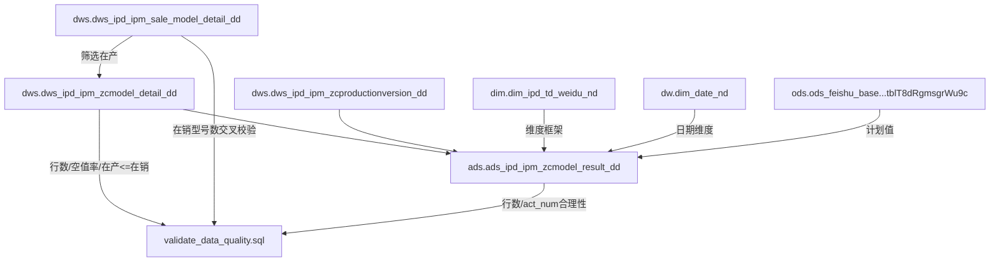

# 血缘关系文档 - 在产型号数

## 基本信息
- **需求ID**: 005-zcmodel-count
- **血缘版本**: 1.4
- **生成日期**: 2026-05-27
- **状态**: 活跃

## 数据流转概览
```
[DWS层] dws_ipd_ipm_zcmodel_detail_dd
  ← dws.dws_ipd_ipm_sale_model_detail_dd (在销型号明细，筛选model_label_10='在产')
         ↓
[ADS层] ads_ipd_ipm_zcmodel_result_dd
  ← dws.dws_ipd_ipm_zcmodel_detail_dd (在产型号明细汇总)
  ← dws.dws_ipd_ipm_zcproductionversion_dd (生产版本口径汇总)
  ← dim.dim_ipd_td_weidu_nd (维度框架：事业部/公司/产品线/内外销)
  ← dw.dim_date_nd (日期维度)
  ← ods.ods_feishu_base_P8vTbFzrTaWtQLspDwgcpbm8nng_tblT8dRgmsgrWu9c (计划值)
         ↓
[质量检查] validate_data_quality.sql
  ← dws.dws_ipd_ipm_zcmodel_detail_dd (行数、空值率、在产<=在销校验)
  ← dws.dws_ipd_ipm_sale_model_detail_dd (在产<=在销交叉校验)
  ← ads.ads_ipd_ipm_zcmodel_result_dd (行数、act_num合理性)
```

## 血缘关系图


## 核心关联路径

### 在产型号筛选
1. 从在销型号明细表筛选 `model_label_10 = '在产'` 的记录
2. 冰冷洗额外剔除代工产品（通过 `model_label_4` 规划生产基地判断）
3. 厨电代工剔除逻辑（自制判定：规划生产基地包含"6516-黄岛厨电工厂"为自制）：
   - 内销：规划生产基地（plan_base）不包含"6516-黄岛厨电工厂" → 非自制（外购/ODM），标记 is_project='Y' 不纳入统计
   - 外销：品牌为OEM品牌 → 剔除；规划生产基地不包含"6516-黄岛厨电工厂" → 非自制（外协），标记 is_project='Y' 不纳入统计
4. 空调/视像科技直接继承在销型号的判定结果

### ADS层汇总
1. 产品型号口径：按 `model` 去重计数，覆盖公司：冰冷、洗衣机、空调公司、视像科技、厨电
2. 生产版本口径：按 `proversion` 去重计数，覆盖公司：冰冷、洗衣机、空调公司、视像科技
3. 集团汇总：汇总冰冷事业部（全部/全部）、显示事业部（视像科技/全部）、空气事业部（全部/全部）、洗护事业部（洗衣机/全部）、厨电事业部（全部/全部）
4. 多产品线公司（生成"全部"产品线汇总行）：冰冷、空调公司、厨电
5. 完成率公式：`2 - (实际值 / 计划值)`

### 数据质量检查
1. DWS层行数检查：验证当月 `dws_ipd_ipm_zcmodel_detail_dd` 数据行数 > 0
2. DWS层关键字段空值率：验证 `model`、`product_line` 字段无空值
3. DWS层在产<=在销校验：按产品线对比在产型号数 <= 在销型号数
4. ADS层行数检查：验证当月 `ads_ipd_ipm_zcmodel_result_dd` 数据行数 > 0
5. ADS层合理性检查：验证 `act_num` > 0

## 详细血缘关系

### 1. 源表（输入）
| 表名 | 数据库 | 用途 |
|------|--------|------|
| dws_ipd_ipm_sale_model_detail_dd | dws | 在销型号明细（筛选在产型号） |
| dws_ipd_ipm_zcmodel_detail_dd | dws | 在产型号明细（ADS层汇总源） |
| dws_ipd_ipm_zcproductionversion_dd | dws | 在产生产版本明细（生产版本口径） |
| dim_ipd_td_weidu_nd | dim | 维度框架表（事业部/公司/产品线/内外销组合） |
| dim_date_nd | dw | 日期维度表（年月筛选） |
| ods_feishu_base_P8vTbFzrTaWtQLspDwgcpbm8nng_tblT8dRgmsgrWu9c | ods | 飞书多维表格（在产型号计划值） |

### 2. 目标表（输出）
| 表名 | 数据库 | 用途 |
|------|--------|------|
| dws_ipd_ipm_zcmodel_detail_dd | dws | 在产型号明细表 |
| ads_ipd_ipm_zcmodel_result_dd | ads | 在产型号数结果表 |

### 3. 质量检查涉及表
| 表名 | 数据库 | 检查项 |
|------|--------|--------|
| dws_ipd_ipm_zcmodel_detail_dd | dws | 行数检查、关键字段空值率、在产<=在销校验 |
| dws_ipd_ipm_sale_model_detail_dd | dws | 在产<=在销交叉校验（对比基准） |
| ads_ipd_ipm_zcmodel_result_dd | ads | 行数检查、act_num合理性检查 |

### 4. 字段级血缘（DWS层核心字段）
| 源字段 | 源表 | 目标字段 | 目标表 | 转换逻辑 |
|--------|------|----------|--------|----------|
| model | dws_sale_model_detail | model | dws_zcmodel_detail | 直接映射（筛选model_label_10='在产'） |
| product_line | dws_sale_model_detail | product_line | dws_zcmodel_detail | 直接映射 |
| company | dws_sale_model_detail | company | dws_zcmodel_detail | 直接映射 |
| in_out_sale | dws_sale_model_detail | in_out_sale | dws_zcmodel_detail | 直接映射 |
| model_label_4 | dws_sale_model_detail | is_project | dws_zcmodel_detail | 冰冷洗：非海信自有工厂→'Y'（剔除代工） |
| plan_base | dws_sale_model_detail | is_project | dws_zcmodel_detail | 厨电自制判定：plan_base包含'6516-黄岛厨电工厂'为自制；内销：plan_base NOT LIKE '%6516-黄岛厨电工厂%'→'Y'（非自制）；外销：brand='OEM品牌'→'Y' 或 plan_base NOT LIKE '%6516-黄岛厨电工厂%'→'Y'（外协） |
| is_project | dws_sale_model_detail | is_project | dws_zcmodel_detail | 继承在销型号的保护期判定（厨电/冰冷洗代工逻辑覆盖） |
| dt_month | dws_sale_model_detail | dt_month | dws_zcmodel_detail | 直接映射 |

### 5. 字段级血缘（ADS层核心字段 - 产品型号口径）
| 源字段 | 源表 | 目标字段 | 目标表 | 转换逻辑 |
|--------|------|----------|--------|----------|
| model | dws_zcmodel_detail | act_num | ads_zcmodel_result | COUNT(DISTINCT model) WHERE is_project='N'，按公司/产品线/内外销分组 |
| dt_month | dws_zcmodel_detail | dt_month | ads_zcmodel_result | 直接映射 |
| business_division | dws_zcmodel_detail | business_division | ads_zcmodel_result | GROUP BY维度 |
| company | dws_zcmodel_detail | company | ads_zcmodel_result | GROUP BY维度，覆盖：冰冷/洗衣机/空调公司/视像科技/厨电 |
| product_line | dws_zcmodel_detail | product_line | ads_zcmodel_result | GROUP BY维度，多产品线公司（冰冷/空调公司/厨电）生成"全部"汇总行 |
| in_out_sale | dws_zcmodel_detail | in_out_sale | ads_zcmodel_result | GROUP BY维度，同时生成"全部"汇总行 |
| — | dim_ipd_td_weidu_nd | business_division/company/product_line/in_out_sale | ads_zcmodel_result | 维度框架（zhibiao='在产型号数'） |
| year_mth | dim_date_nd | dt_month | ads_zcmodel_result | 日期维度筛选（当年各月） |
| record_data→在产型号计划值 | ods_feishu_base...tblT8dRgmsgrWu9c | plan_num | ads_zcmodel_result | JSON解析计划值 |
| — | — | data_type | ads_zcmodel_result | 常量：'在产型号-产品型号口径' |
| act_num, plan_num | ads_zcmodel_result(自身) | completion_rate | ads_zcmodel_result | 公式：2-(act_num/plan_num) |

### 6. 字段级血缘（ADS层 - 集团汇总）
| 源字段 | 源表 | 目标字段 | 目标表 | 转换逻辑 |
|--------|------|----------|--------|----------|
| act_num | ads_zcmodel_result(各事业部) | act_num | ads_zcmodel_result(集团汇总) | SUM(act_num)，按事业部筛选条件汇总 |
| — | — | business_division | ads_zcmodel_result(集团汇总) | 常量：'集团汇总' |
| — | — | company | ads_zcmodel_result(集团汇总) | 常量：'集团汇总' |
| — | — | product_line | ads_zcmodel_result(集团汇总) | 常量：'全部' |

**集团汇总事业部筛选条件**：
| 事业部 | product_line条件 | in_out_sale条件 |
|--------|-----------------|----------------|
| 冰冷事业部 | 全部 | 全部 / 内销+外销 |
| 显示事业部 | 视像科技 | 全部 / 内销+外销 |
| 空气事业部 | 全部 | 全部 / 内销+外销 |
| 洗护事业部 | 洗衣机 | 全部 / 内销+外销 |
| 厨电事业部 | 全部 | 全部 / 内销+外销 |

### 7. 字段级血缘（ADS层 - 生产版本口径）
| 源字段 | 源表 | 目标字段 | 目标表 | 转换逻辑 |
|--------|------|----------|--------|----------|
| proversion | dws_zcproductionversion | act_num | ads_zcmodel_result | COUNT(DISTINCT proversion) WHERE is_project='N' |
| company | dws_zcproductionversion | company | ads_zcmodel_result | GROUP BY维度，覆盖：冰冷/洗衣机/空调公司/视像科技 |
| product_line | dws_zcproductionversion | product_line | ads_zcmodel_result | GROUP BY维度 |
| in_out_sale | dws_zcproductionversion | in_out_sale | ads_zcmodel_result | GROUP BY维度，同时生成"全部"汇总行 |
| — | — | data_type | ads_zcmodel_result | 常量：'在产型号-生产版本口径' |

### 8. 字段级血缘（质量检查脚本）
| 源字段 | 源表 | 检查逻辑 | 检查项 |
|--------|------|----------|--------|
| dt_month | dws_zcmodel_detail | 过滤当月数据 | 所有DWS检查 |
| model | dws_zcmodel_detail | IS NULL OR = '' 空值检测 | 关键字段空值率 |
| product_line | dws_zcmodel_detail | IS NULL OR = '' 空值检测 | 关键字段空值率 |
| model | dws_zcmodel_detail | COUNT(DISTINCT) WHERE is_project='N' | 在产<=在销校验 |
| model | dws_sale_model_detail | COUNT(DISTINCT) WHERE is_project='N' | 在产<=在销校验（对比基准） |
| dt_month | ads_zcmodel_result | 过滤当月数据 | ADS行数检查 |
| act_num | ads_zcmodel_result | <= 0 异常检测 | 型号数合理性 |

## 影响分析

### 正向追溯（从源到目标）
- `dws.dws_ipd_ipm_sale_model_detail_dd` → `dws.dws_ipd_ipm_zcmodel_detail_dd` → `ads.ads_ipd_ipm_zcmodel_result_dd`
- `dws.dws_ipd_ipm_zcproductionversion_dd` → `ads.ads_ipd_ipm_zcmodel_result_dd`
- `dim.dim_ipd_td_weidu_nd` → `ads.ads_ipd_ipm_zcmodel_result_dd`（维度框架）
- `dw.dim_date_nd` → `ads.ads_ipd_ipm_zcmodel_result_dd`（日期维度）
- `ods.ods_feishu_base_P8vTbFzrTaWtQLspDwgcpbm8nng_tblT8dRgmsgrWu9c` → `ads.ads_ipd_ipm_zcmodel_result_dd`（计划值）

### 反向影响（从目标到源）
- `ads.ads_ipd_ipm_zcmodel_result_dd` ← `dws.dws_ipd_ipm_zcmodel_detail_dd` ← `dws.dws_ipd_ipm_sale_model_detail_dd`
- `ads.ads_ipd_ipm_zcmodel_result_dd` ← `dws.dws_ipd_ipm_zcproductionversion_dd`
- `ads.ads_ipd_ipm_zcmodel_result_dd` ← `dim.dim_ipd_td_weidu_nd`
- `ads.ads_ipd_ipm_zcmodel_result_dd` ← `ods.ods_feishu_base_P8vTbFzrTaWtQLspDwgcpbm8nng_tblT8dRgmsgrWu9c`

### 质量检查依赖
- `validate_data_quality.sql` 依赖 `dws.dws_ipd_ipm_zcmodel_detail_dd`、`dws.dws_ipd_ipm_sale_model_detail_dd`、`ads.ads_ipd_ipm_zcmodel_result_dd`
- 必须在 DWS 和 ADS 层 ETL 脚本执行完成后运行

## 产品线覆盖范围

### 产品型号口径（ads_ipd_ipm_zcmodel_result_dd）
| 公司 | 事业部 | 是否多产品线 | 说明 |
|------|--------|-------------|------|
| 冰冷 | 冰冷事业部 | 是 | 含冰箱、冷柜子产品线 |
| 洗衣机 | 洗护事业部 | 否 | 单产品线 |
| 空调公司 | 空气事业部 | 是 | 含家用空调、中央空调子产品线 |
| 视像科技 | 显示事业部 | 否 | 单产品线 |
| 厨电 | 厨电事业部 | 是 | 含多个厨电子产品线 |
| 集团汇总 | 集团汇总 | — | 各事业部汇总 |

### 生产版本口径（ads_ipd_ipm_zcmodel_result_dd）
| 公司 | 说明 |
|------|------|
| 冰冷 | 支持 |
| 洗衣机 | 支持 |
| 空调公司 | 支持 |
| 视像科技 | 支持 |

## 变更记录
| 变更日期 | 变更类型 | 变更描述 | 变更人 |
|----------|----------|----------|--------|
| 2026-04-29 | 新增 | 初始血缘关系（从已有脚本录入） | ETL智能辅助工具 |
| 2026-05-09 | 更新 | 新增数据质量检查脚本血缘关系（validate_data_quality.sql） | ETL智能辅助工具 |
| 2026-05-09 | 更新 | 厨电在产型号代工剔除逻辑变更：内销从"plan_base为空=ODM"改为"plan_base不含海信=非自制"；外销新增"plan_base不含海信=外协"剔除规则 | ETL智能辅助工具 |
| 2026-05-20 | 更新 | 厨电自制判定条件细化：从"plan_base包含海信"改为"plan_base包含6516-黄岛厨电工厂"，更精确定位厨电自有工厂 | ETL智能辅助工具 |
| 2026-05-21 | 更新 | ADS层产品型号口径新增厨电产品线支持：DELETE/INSERT覆盖范围加入'厨电'；集团汇总新增厨电事业部（product_line='全部', in_out_sale='全部/内销+外销'）；厨电加入多产品线公司列表（生成"全部"产品线汇总行） | ETL智能辅助工具 |
| 2026-05-27 | 状态更新 | 厨电在产型号草稿文件（dws_ipd_ipm_zcmodel_detail_dd_chudian_draft.sql）标记为"已合入正式脚本"，逻辑已合并到 dws_ipd_ipm_zcmodel_detail_dd.sql，血缘关系无变化 | ETL智能辅助工具 |
