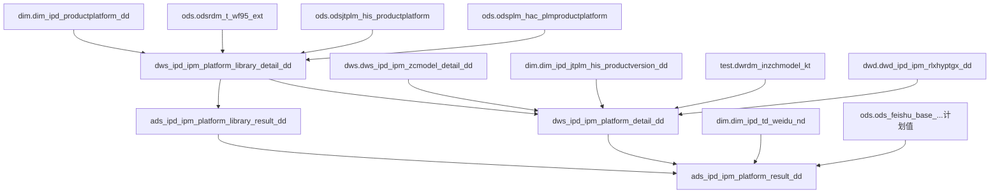

# 血缘关系文档 - 平台数

## 基本信息
- **需求ID**: 006-platform-count
- **血缘版本**: 1.0
- **生成日期**: 2026-04-29
- **状态**: 活跃

## 数据流转概览
```
[DWS层] dws_ipd_ipm_platform_library_detail_dd (平台库明细)
  ← dim.dim_ipd_productplatform_dd (冰冷洗平台库)
  ← ods.odsrdm_t_wf95_ext + ods.odsrdm_t_obj_baseitem (空调平台库)
  ← ods.odsjtplm_his_productplatform (视像科技平台库)
  ← ods.odsplm_hac_plmproductplatform (日立平台库)
         ↓
[ADS层] ads_ipd_ipm_platform_library_result_dd (平台库结果)

[DWS层] dws_ipd_ipm_platform_detail_dd (产品平台数明细)
  ← dws.dws_ipd_ipm_zcmodel_detail_dd (在产型号)
  ← dws.dws_ipd_ipm_platform_library_detail_dd (平台库)
  ← dim.dim_ipd_jtplm_his_productversion_dd (视像科技生产版本)
  ← test.dwrdm_inzchmodel_kt (空调在产型号)
  ← dwd.dwd_ipd_ipm_rlxhyptgx_dd (日立型号平台关系)
         ↓
[ADS层] ads_ipd_ipm_platform_result_dd (产品平台数结果)
  ← dim.dim_ipd_td_weidu_nd (维度配置)
  ← dw.dim_date_nd (日期维度)
  ← ods.ods_feishu_base_...tblugJ2ghgEELtWU (飞书计划值)
```

## 血缘关系图


## 核心关联路径

### 平台库平台数
1. 冰冷洗：`dim.dim_ipd_productplatform_dd` → 筛选发布/禁选状态
2. 空调：`ods.odsrdm_t_wf95_ext` + 属性解码 → 筛选发布/禁选状态
3. 视像科技：`ods.odsjtplm_his_productplatform` → 筛选发布/禁选状态
4. 日立：`ods.odsplm_hac_plmproductplatform` → 筛选发布/禁选状态

### 产品平台数
1. 冰冷洗内销：在产型号 → 关联平台库 → 排除代工专用
2. 空调内销：空调在产型号 → 室内/室外箱体平台
3. 视像科技内销：在产型号 → 关联生产版本平台
4. 日立：型号平台关系表 → 关联平台库
5. 出口：各产品线在产型号 → 关联平台

## 详细血缘关系

### 1. 源表（输入）
| 表名 | 数据库 | 用途 |
|------|--------|------|
| dim_ipd_productplatform_dd | dim | 冰冷洗平台库（平台名称、状态、产品线） |
| odsrdm_t_wf95_ext | ods | 空调RDM平台库 |
| odsrdm_t_obj_baseitem | ods | RDM属性解码 |
| odsjtplm_his_productplatform | ods | 视像科技JTPLM平台库 |
| odsplm_hac_plmproductplatform | ods | 日立PLM平台库 |
| dws_ipd_ipm_zcmodel_detail_dd | dws | 在产型号明细（产品平台数关联） |
| dim_ipd_jtplm_his_productversion_dd | dim | 视像科技生产版本 |
| dwd_ipd_ipm_rlxhyptgx_dd | dwd | 日立型号平台关系 |
| dim_ipd_platform_library_class_name_nd | dim | 平台库产品线分类映射 |

### 2. 目标表（输出）
| 表名 | 数据库 | 用途 |
|------|--------|------|
| dws_ipd_ipm_platform_library_detail_dd | dws | 平台库平台明细表 |
| dws_ipd_ipm_platform_detail_dd | dws | 产品平台数明细表 |
| ads_ipd_ipm_platform_library_result_dd | ads | 平台库平台结果表 |
| ads_ipd_ipm_platform_result_dd | ads | 产品平台数结果表 |

### 3. 字段级血缘（平台库DWS层）
| 源字段 | 源表 | 目标字段 | 目标表 | 转换逻辑 |
|--------|------|----------|--------|----------|
| 平台名称 | 各平台库源表 | platform | dws平台库明细 | 直接映射（冰冷洗/空调/视像/日立各取各源） |
| 平台状态 | 各平台库源表 | platform_state | dws平台库明细 | 直接映射 |
| 产品线分类 | dim_platform_library_class_name_nd | product_line | dws平台库明细 | 通过映射表关联 |
| 平台状态 | — | is_project | dws平台库明细 | 发布/禁选→'N'（纳入统计），其他→'Y' |

### 4. 字段级血缘（产品平台数DWS层）
| 源字段 | 源表 | 目标字段 | 目标表 | 转换逻辑 |
|--------|------|----------|--------|----------|
| model | dws_zcmodel_detail | model | dws平台数明细 | 在产型号名称 |
| platform | dws平台库明细 | platform | dws平台数明细 | 型号关联的平台名称 |
| product_line | dws_zcmodel_detail | product_line | dws平台数明细 | 直接映射 |
| is_project | dws_zcmodel_detail | is_project | dws平台数明细 | 继承在产型号保护期 |

### 5. 字段级血缘（ADS层）
| 源字段 | 源表 | 目标字段 | 目标表 | 转换逻辑 |
|--------|------|----------|--------|----------|
| platform | dws平台库明细 | act_value | ads平台库结果 | COUNT(DISTINCT platform) WHERE is_project='N' |
| platform | dws平台数明细 | act_value | ads产品平台结果 | COUNT(DISTINCT platform) WHERE is_project='N' |
| — | ods飞书计划值 | plan_value | ads结果 | 从飞书表获取计划值 |
| act_value / plan_value | — | completion_rate | ads结果 | 2 - 实际值/计划值（平台越少越好） |

## 变更记录
| 变更日期 | 变更类型 | 变更描述 | 变更人 |
|----------|----------|----------|--------|
| 2026-04-29 | 新增 | 初始血缘关系（从已有脚本录入） | ETL智能辅助工具 |
