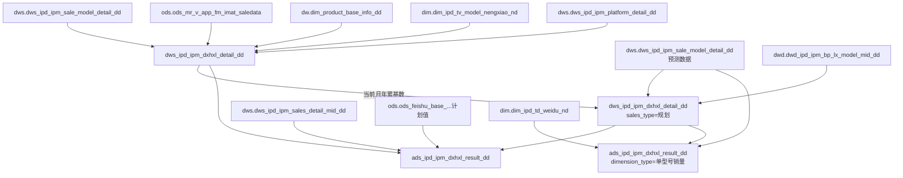

# 血缘关系文档 - 单型号销量

## 基本信息
- **需求ID**: 007-single-model-sales
- **血缘版本**: 3.0
- **生成日期**: 2026-06-29
- **状态**: 活跃

## 数据流转概览
```
[DWS层] dws_ipd_ipm_dxhxl_detail_dd
  ← dws.dws_ipd_ipm_sale_model_detail_dd (在销型号明细，提供型号列表+维度属性)
  ← ods.ods_mr_v_app_fm_imat_saledata (管报实际销量)
  ← dw.dim_product_base_info_dd (MDG桥梁：物料→型号映射)
  ← dim.dim_ipd_tv_model_nengxiao_nd (能效机→原型机映射，视像+激光)
  ← dws.dws_ipd_ipm_platform_detail_dd (平台引用判断，激光段)
         ↓
[DWS层-预测] dws_ipd_ipm_dxhxl_detail_dd (dt_type='月', sales_type='规划')
  ← dws.dws_ipd_ipm_sale_model_detail_dd (在销型号数预测，dt_type='月'，提供未来月份型号范围)
  ← dwd.dwd_ipd_ipm_bp_lx_model_mid_dd (BP/LX规划量，作为预测销量)
  ← dws.dws_ipd_ipm_dxhxl_detail_dd (上月实际年累基数，实际销量滞后一个月)
  脚本：dws_ipd_ipm_dxhxl_detail_dd_hitari_forecast.sql
  依赖：dws_ipd_ipm_sale_model_detail_dd_hitari_forecast.sql（需先执行）
         ↓
[ADS层] ads_ipd_ipm_dxhxl_result_dd
  ← dws.dws_ipd_ipm_dxhxl_detail_dd (单型号销量明细)
  ← dws.dws_ipd_ipm_sale_model_detail_dd (在销型号数)
  ← dws.dws_ipd_ipm_sales_detail_mid_dd (外销sellin数据)
  ← ods.ods_feishu_base_...tblT8dRgmsgrWu9c (飞书计划值)
         ↓
[ADS层-预测] ads_ipd_ipm_dxhxl_result_dd (dimension_type='单型号销量')
  ← dws.dws_ipd_ipm_dxhxl_detail_dd (实际数据sales_type='管报' + 预测数据sales_type='规划'，统一dt_type='月'，混合提供销量/销额)
  ← dim.dim_ipd_td_weidu_nd (维度交叉配置)
  月份范围：上个月（实际）~ 今年12月（预测）
  脚本：ads_ipd_ipm_dxhxl_result_dd_hitari_forecast.sql
  依赖：dws_ipd_ipm_dxhxl_detail_dd_hitari_forecast.sql（需先执行DWS预测）
```

## 血缘关系图


## DWS层各段落血缘明细

### 第1段：冰冷洗内销（管报）
| 源表 | 别名 | 用途 | JOIN条件 |
|------|------|------|----------|
| dws.dws_ipd_ipm_sale_model_detail_dd | t1(zx_model) | 型号列表+保护期 | product_line IN ('冰箱','冷柜','洗衣机'), in_out_sale='内销' |
| ods.ods_mr_v_app_fm_imat_saledata | t1(sale_amt) | 管报实际销量 | yearmonth=上月 |
| dw.dim_product_base_info_dd | t2(sale_amt) | MDG物料→型号映射 | t1.matnr=t2.product_code, product_type_code='FERT' |

**输出字段**：dt_month, dt_type, business_division, company, product_line, in_out_sale, prdct_model, model, sales_qty, sales_amt, sales_type, model_label_1~4, model_label_10, is_project, load_dt, act_cost, act_gross_profit

### 第2段：厨电内销（管报）
| 源表 | 别名 | 用途 | JOIN条件 |
|------|------|------|----------|
| dws.dws_ipd_ipm_sale_model_detail_dd | t1(zx_model) | 型号列表+保护期 | company IN ('厨电'), in_out_sale='内销' |
| ods.ods_mr_v_app_fm_imat_saledata | t1(sale_amt) | 管报实际销量 | yearmonth=上月 |
| dw.dim_product_base_info_dd | t2(sale_amt) | MDG物料→型号映射 | t1.matnr=t2.product_code, product_type_code='FERT' |

**输出字段**：同第1段

### 第3段：视像科技内销（管报+能效机转换）
| 源表 | 别名 | 用途 | JOIN条件 |
|------|------|------|----------|
| dws.dws_ipd_ipm_sale_model_detail_dd | t1(zx_model) | 型号列表+保护期 | company='视像科技', in_out_sale='内销' |
| ods.ods_mr_v_app_fm_imat_saledata | t1(sale_amt) | 管报实际销量 | yearmonth=上月 |
| dw.dim_product_base_info_dd | t2(sale_amt) | MDG物料→型号映射 | t1.matnr=t2.product_code, product_type_code='FERT' |
| dim.dim_ipd_tv_model_nengxiao_nd | t3(sale_amt) | 能效机→原型机映射 | t2.model_name=t3.model_nengxiao |

**输出字段**：dt_month, dt_type, business_division, company, product_line, in_out_sale, model, sales_qty, sales_amt, sales_type, model_label_1(platform), model_label_3, model_label_9, model_label_10, is_project, load_dt, act_cost, act_gross_profit, model_label_2, brand, plan_channel, countries_regions, productline_tv

### 第4段：空调公司（管报，含中央空调sale_model_code口径+年累）
| 源表 | 别名 | 用途 | JOIN条件 |
|------|------|------|----------|
| dws.dws_ipd_ipm_sale_model_detail_dd | t1(zx_model) | 型号列表+保护期+维度属性 | company='空调公司'，中央空调含内外销 |
| ods.ods_mr_v_app_fm_imat_saledata | t1(sales_amt_1) | 管报实际销量（通用路径） | yearmonth=上月 |
| dw.dim_product_base_info_dd | t2(sales_amt_1) | MDG物料→型号映射（通用） | product_type_code IN ('FERT','ZTAO'), delete_flag!='Y' |
| ods.ods_mr_v_app_fm_imat_saledata | t1(t3子查询) | 管报实际销量（中央空调月度） | yearmonth=上月 |
| dw.dim_product_base_info_dd | t2(t3子查询) | MDG物料→sale_model_code映射（日立） | product_type_code='FERT', create_company='RILI', substring关联(前14位) |
| ods.ods_mr_v_app_fm_imat_saledata | t1(t4子查询) | 管报实际销量（中央空调年累） | yearmonth<=上月 且 同年 |
| dw.dim_product_base_info_dd | t2(t4子查询) | MDG物料→sale_model_code映射（日立年累） | 同t3子查询 |

**JOIN逻辑说明**：
- t2(sale_amt CTE)：通过model_name按型号汇总，覆盖非日立产品线
- t3(LEFT JOIN子查询)：中央空调月度销量，按sale_model_code汇总，条件：product_line='中央空调' AND PC20006='标准品'
- t4(LEFT JOIN子查询)：中央空调年累销量，按sale_model_code汇总（yearmonth<=上月且同年），条件同t3
- 最终销量取值：COALESCE(t3.sale_qty, t2.sale_qty) — 中央空调优先用sale_model_code口径

**输出字段**：dt_month, dt_type, business_division, company, product_line, in_out_sale, model, sales_qty, sales_amt, sales_type, model_label_1(platform), model_label_3, model_label_10, is_project, load_dt, act_cost, act_gross_profit, kt_nbzz, product_big, product_mid, product_sml, platform, productmodel, chanpindingwei, plan_base, brand, productmodel__life, act_time_ss, act_time_tszb, act_time_tzxd, act_time_tzsc, PG00015, productmodel_id, salemodel, salemodel_code, salemodel_id, PC20080, HX00379, PC20006, is_project_nk, matnr, HX00327, PC20018, PG00009, sales_qty_y, sales_amt_y

### 第5段：激光内销（管报+能效机转换+平台引用判断）
| 源表 | 别名 | 用途 | JOIN条件 |
|------|------|------|----------|
| dws.dws_ipd_ipm_sale_model_detail_dd | t1(zx_model) | 型号列表+保护期 | company='激光', in_out_sale='内销' |
| ods.ods_mr_v_app_fm_imat_saledata | t1(sale_amt) | 管报实际销量 | yearmonth=上月 |
| dw.dim_product_base_info_dd | t2(sale_amt) | MDG物料→型号映射 | product_type_code='FERT' |
| dim.dim_ipd_tv_model_nengxiao_nd | t3(sale_amt) | 能效机→原型机映射 | t2.model_name=t3.model_nengxiao |
| dws.dws_ipd_ipm_platform_detail_dd | t3(主SELECT) | 平台引用判断 | company='激光', in_out_sale='内销', is_project='N' |

**输出字段**：dt_month, dt_type, business_division, company, product_line, in_out_sale, model, sales_qty, sales_amt, sales_type, model_label_1(platform), model_label_10, is_project, load_dt, act_cost, act_gross_profit, is_platformsalemodel

### 第6段：中央空调日立 — 未来月份预测（独立脚本）

**脚本文件**：`dws_ipd_ipm_dxhxl_detail_dd_hitari_forecast.sql`

**功能**：基于在销型号数预测结果 + BP/LX规划量，生成中央空调日立未来各月的单型号销量预测数据

**前置依赖**：`dws_ipd_ipm_sale_model_detail_dd_hitari_forecast.sql`（在销型号数预测，须先执行）

| 源表 | 用途 | JOIN条件/说明 |
|------|------|---------------|
| dws.dws_ipd_ipm_sale_model_detail_dd | 在销型号数预测数据（未来月份型号范围） | company='空调公司', product_line='中央空调', dt_type='月', model_label_10!='老品清零'（当前月取实际数据，未来月取预测数据） |
| dwd.dwd_ipd_ipm_bp_lx_model_mid_dd | BP/LX规划量（月度规划销量/销额作为预测值） | 按salemodelcode+dt_month关联，取对应未来月份的规划量 |
| dws.dws_ipd_ipm_dxhxl_detail_dd | 上月实际年累基数（实际销量滞后一个月） | company='空调公司', product_line='中央空调', dt_type='月', dt_month=上月，取sales_qty_y/sales_amt_y |

**数据处理逻辑**：
1. 生成月份序列：CURDATE()-1天所在月 到 当年12月（offset从0开始，当前月也纳入预测）
2. 从在销型号数预测表取各未来月份的中央空调在产型号范围
3. 每个型号的月度规划量从BP/LX表中按salemodelcode+月份获取
4. 年累销量 = 上月实际年累 + 从当前月+1开始逐月规划量的累加

**输出特征**：
- dt_type = '月'（与实际数据相同，通过sales_type='规划'区分）
- sales_qty = 月度规划量（代替实际销量）
- sales_amt = 月度规划销额（代替实际销额）
- sales_qty_y = 实际年累基数 + 规划量逐月累加
- sales_amt_y = 实际年累销额基数 + 规划销额逐月累加
- 维度属性字段从在销型号数预测表透传（37个字段）

**DELETE范围**：company='空调公司' AND product_line='中央空调' AND dt_type='月' AND sales_type='规划' AND dt_month从昨天所在月（当前月）开始到当年12月

**输出字段**：dt_month, dt_type, business_division, company, product_line, in_out_sale, model, sales_qty, sales_amt, sales_type, model_label_1, model_label_10, is_project, load_dt, kt_nbzz, product_big, product_mid, product_sml, platform, productmodel, chanpindingwei, plan_base, brand, productmodel__life, act_time_ss, act_time_tszb, act_time_tzxd, act_time_tzsc, PG00015, productmodel_id, salemodel, salemodel_code, salemodel_id, PC20080, HX00379, PC20006, is_project_nk, matnr, HX00327, PC20018, PG00009, sales_qty_y, sales_amt_y

## ADS层预测血缘明细

### ADS层：日立单型号销量未来月份预测（v2 维度交叉结构）

**脚本文件**：`ads_ipd_ipm_dxhxl_result_dd_hitari_forecast.sql`

**功能**：基于DWS层预测数据（dt_type='月', sales_type='规划'）+ 实际数据（sales_type='管报'），按维度交叉方式计算中央空调日立未来各月的单型号销量/销额ADS结果

**前置依赖**：`dws_ipd_ipm_dxhxl_detail_dd_hitari_forecast.sql`（DWS预测，须先执行）

**当前状态**：骨架阶段（维度交叉CTE已定义，最终明细数据+聚合SELECT待补充）

| 源表 | 用途 | JOIN条件/说明 |
|------|------|---------------|
| dws.dws_ipd_ipm_dxhxl_detail_dd | DWS实际+预测数据联合（dt_type='月'，sales_type='管报'为实际，'规划'为预测），提供型号级明细销量/销额 | company='空调公司', product_line='中央空调' |
| dim.dim_ipd_td_weidu_nd | 维度交叉配置表（营销部/产品小类等维度值列表） | zhibiao IN ('事业部','事业部合计','工程营销部','产品小类') |

**CTE结构（v2完整版）**：
1. `month_seq` — 月份偏移序列（offset: -1~11，共13个月）
2. `target_months` — 目标月份列表（上个月~当年12月，限制在今年内）
3. `weidu_dt_type` — 日期类型维度（'年'/'月'）
4. `weidu_dimension_1` — 第一维度（'总体'/'营销部'/'品牌'）
5. `weidu_dimension_2` — 第二维度（从dim_ipd_td_weidu_nd取事业部/事业部合计/工程营销部的值列表）
6. `weidu_dimension_3` — 第三维度（从dim_ipd_td_weidu_nd取产品小类的值列表）
7. `weidu_dimension_4` — 第四维度（固定'合计'）
8. `weidu_brand` — 品牌维度（'海信'/'约克'/'日立'/'其他'/'合计'）
9. `weidu_koujing` — 口径维度（'集团'/'内控'）
10. `weidu_zhibiao_type` — 指标类型维度（'在售'/'退市'/'在产'）
11. `weidu_all` — 维度全交叉（CROSS JOIN所有维度CTE + target_months，含过滤：集团口径只看在售且不含考核营销部）
12. `weidu_datacopy` — 数据副本维度（'正常'/'各营销部'/'内销合计'/'内外销'/'合计'/'品牌'/'品牌合计'/'工程营销部'）
13. `sales_all` — 明细级取数（月度+年度两段UNION ALL）：从dws_ipd_ipm_dxhxl_detail_dd取数，CROSS JOIN weidu_koujing和target_months；月度段采用二层结构——内层按源月(dws.dt_month)独立GROUP BY+COUNT(DISTINCT model)得到每月去重型号数，外层SUM(ct)得到近3月型号数之和（集团口径取近3月、内控口径取当月）；年度段集团口径取今年到目标月所有月份跨月去重COUNT(DISTINCT model)、内控口径取当月
14. `sales_all_jiagong` — 维度加工：将sales_all的明细按datacopy规则复制到维度组合（FULL JOIN weidu_datacopy/zhibiao_type(在产+在售)/bzp_dzp(合计)/chanpinpinlei），含内销合计/内外销/工程营销部等datacopy路由逻辑
15. `act_value` — 最终聚合：SUM(ct)/SUM(sales_qty)/SUM(sales_amt)，计算dxhxl=SUM(sales_qty)/NULLIF(SUM(ct),0)和dxhxe=SUM(sales_amt)/NULLIF(SUM(ct),0)

**数据处理逻辑**（v2完整版，对齐原ADS脚本结构）：
1. 维度交叉生成所有组合行（weidu_all），覆盖所有目标月份×维度组合
2. 明细数据（sales_all）：从DWS取型号级明细，按口径(集团/内控)+时间(月/年)分别取数
   - 月度-集团口径：取目标月近3月(target_month, -1月, -2月)明细，**内层按源月(dws.dt_month)独立GROUP BY + COUNT(DISTINCT model)得到每月去重型号数，外层SUM(ct)得到近3月型号数之和**（先分月去重再相加模式）
   - 月度-内控口径：取目标月当月明细
   - 年度-集团口径：取今年到目标月的所有月份，跨月合并去重COUNT(DISTINCT model)
   - 年度-内控口径：取目标月当月（取sales_qty_y/sales_amt_y年累字段）
3. 维度加工（sales_all_jiagong）：将明细数据按datacopy规则复制到对应维度组合行（FULL JOIN 4个维度扩展CTE）
4. 统一聚合（act_value）：SUM(ct) + SUM(sales_qty) + SUM(sales_amt)，计算dxhxl/dxhxe
5. 最终SELECT：weidu_all LEFT JOIN act_value → 输出21字段

**关键设计点**：
- 月度型号数计算采用"先分月去重再相加"模式：sales_all月度段集团口径内层按源月(dws.dt_month)独立GROUP BY+COUNT(DISTINCT model)得到每月去重型号数，外层SUM(ct)得到近3月型号数之和（即同一型号在3个月中每月出现都计1次，最多计3次）；年度段仍为跨月合并去重COUNT(DISTINCT model)（全年只计1次）

**DELETE范围**：company='海信日立' AND dimension_type='单型号销量' AND dt_month从上月（DATE_SUB(昨天, 1 MONTH)）开始到当年12月

**输出字段**（INSERT 21字段）：dt_month, dimension_type, dt_type, company, product_line, in_out_sale, dimension_1, dimension_2, dimension_3, dimension_4, zhibiao_type, rili_nkjt(koujing), model_num(ct), sum_qty(sales_qty), dxhxl, plan_dxhxl(NULL), completion_rate_dxhxl(NULL), sum_amt(sales_amt), dxhxe, plan_dxhxe(NULL), completion_rate_dxhxe(NULL), load_dt

**待完成项**：无（v2完整版已包含维度交叉+明细取数+维度加工+聚合+最终SELECT全部逻辑）

## 核心关联路径

### 内销销量获取
1. **冰冷洗**：`ods管报.matnr` → `dw.MDG.product_code` → `dw.MDG.model_name` → 按产品型号汇总
2. **厨电**：同冰冷洗
3. **视像科技**：同上 + 能效机映射（`dim.dim_ipd_tv_model_nengxiao_nd`：model_nengxiao→model）
4. **空调（非日立）**：`ods管报.matnr` → `dw.MDG.product_code` → `dw.MDG.model_name` → 按产品型号汇总
5. **空调（中央空调/日立）**：`ods管报.matnr` → `dw.MDG.product_code`(前14位匹配) → `dw.MDG.sale_model_code`(RILI) → 按sale_model_code汇总 → LEFT JOIN到zx_model的salemodel_code字段；最终取COALESCE(日立口径, 通用口径)
6. **激光**：同视像科技（含能效机映射） + 平台引用判断（`dws_ipd_ipm_platform_detail_dd`）

### 外销销量获取（ADS层引用）
1. 各产品线：`dws.dws_ipd_ipm_sales_detail_mid_dd`（sellin全量数据）

## 详细血缘关系

### 1. 源表（输入）
| 表名 | 数据库 | 用途 | 引用段落 |
|------|--------|------|----------|
| dws_ipd_ipm_sale_model_detail_dd | dws | 在销型号明细（型号列表+保护期+维度属性透传） | 全部5段+第6段(预测) |
| ods_mr_v_app_fm_imat_saledata | ods | 管报实际销量 | 第1~5段 |
| dim_product_base_info_dd | dw | MDG桥梁（物料→型号映射） | 第1~5段 |
| dim_ipd_tv_model_nengxiao_nd | dim | 能效机→原型机映射 | 第3段(视像)、第5段(激光) |
| dws_ipd_ipm_platform_detail_dd | dws | 产品平台数明细（平台引用判断） | 第5段(激光) |
| dws_ipd_ipm_sales_detail_mid_dd | dws | 外销sellin全量数据 | ADS层引用 |
| dwd_ipd_ipm_bp_lx_model_mid_dd | dwd | BP/LX规划量（月度预测销量来源） | 第6段(预测) |
| dws_ipd_ipm_dxhxl_detail_dd | dws | 上月实际年累基数（自引用，实际销量滞后一个月） | 第6段(预测) |
| dim_ipd_td_weidu_nd | dim | 维度交叉配置（营销部/产品小类等维度值列表） | ADS预测层 |

### 2. 目标表（输出）
| 表名 | 数据库 | 用途 |
|------|--------|------|
| dws_ipd_ipm_dxhxl_detail_dd | dws | 单型号销量明细表 |
| ads_ipd_ipm_dxhxl_result_dd | ads | 单型号销量结果表 |

### 3. 字段级血缘（DWS层核心字段）
| 源字段 | 源表 | 目标字段 | 目标表 | 转换逻辑 | 适用段落 |
|--------|------|----------|--------|----------|----------|
| model | dws_sale_model_detail | model | dws_dxhxl_detail | 产品型号名称，直接映射 | 全部 |
| sale_qty | ods管报 → MDG映射 | sales_qty | dws_dxhxl_detail | SUM(sale_qty) 按型号+月份汇总 | 全部 |
| rev_amt | ods管报 → MDG映射 | sales_amt | dws_dxhxl_detail | SUM(rev_amt) 按型号+月份汇总 | 全部 |
| cost_amt | ods管报 → MDG映射 | act_cost | dws_dxhxl_detail | SUM(cost_amt) 按型号+月份汇总 | 全部 |
| rev_amt - cost_amt | — | act_gross_profit | dws_dxhxl_detail | SUM(rev_amt) - SUM(cost_amt) | 全部 |
| model_nengxiao→model | dim_tv_model_nengxiao | model(视像/激光) | dws_dxhxl_detail | COALESCE(原型机名称, MDG型号名称) | 第3、5段 |
| product_line | dws_sale_model_detail | product_line | dws_dxhxl_detail | 直接映射 | 全部 |
| is_project | dws_sale_model_detail | is_project | dws_dxhxl_detail | 继承在销型号保护期，COALESCE(is_project,'Y') | 全部 |
| platform | dws_sale_model_detail | model_label_1 | dws_dxhxl_detail | 平台名称映射到标签字段 | 第3(视像)、4(空调)、5(激光) |
| model_label_1 | dws_sale_model_detail | model_label_1 | dws_dxhxl_detail | 直接映射（冰冷洗/厨电段落） | 第1、2段 |
| brand | dws_sale_model_detail | brand | dws_dxhxl_detail | 直接映射 | 第3段(视像)、第4段(空调) |
| plan_channel | dws_sale_model_detail | plan_channel | dws_dxhxl_detail | 直接映射 | 第3段(视像) |
| countries_regions | dws_sale_model_detail | countries_regions | dws_dxhxl_detail | 直接映射 | 第3段(视像) |
| productline_tv | dws_sale_model_detail | productline_tv | dws_dxhxl_detail | 直接映射 | 第3段(视像) |
| kt_nbzz | dws_sale_model_detail | kt_nbzz | dws_dxhxl_detail | 空调内部组织 | 第4段(空调) |
| platform(平台明细) | dws_platform_detail | is_platformsalemodel | dws_dxhxl_detail | CASE WHEN platform IS NOT NULL THEN 'Y' ELSE 'N' | 第5段(激光) |
| sale_qty(sale_model_code) | ods管报→MDG(RILI) | sales_qty(中央空调) | dws_dxhxl_detail | COALESCE(t3.sale_qty, t2.sale_qty)，中央空调优先用sale_model_code口径 | 第4段 |
| rev_amt(sale_model_code) | ods管报→MDG(RILI) | sales_amt(中央空调) | dws_dxhxl_detail | COALESCE(t3.rev_amt, t2.rev_amt)，中央空调优先用sale_model_code口径 | 第4段 |
| sale_qty(年累) | ods管报→MDG(RILI) | sales_qty_y | dws_dxhxl_detail | SUM(sale_qty) yearmonth<=上月且同年，按sale_model_code汇总 | 第4段(中央空调) |
| rev_amt(年累) | ods管报→MDG(RILI) | sales_amt_y | dws_dxhxl_detail | SUM(rev_amt) yearmonth<=上月且同年，按sale_model_code汇总 | 第4段(中央空调) |
| product_big | dws_sale_model_detail | product_big | dws_dxhxl_detail | 产品大类，直接透传 | 第4段(空调) |
| product_mid | dws_sale_model_detail | product_mid | dws_dxhxl_detail | 产品中类，直接透传 | 第4段(空调) |
| product_sml | dws_sale_model_detail | product_sml | dws_dxhxl_detail | 产品小类，直接透传 | 第4段(空调) |
| productmodel | dws_sale_model_detail | productmodel | dws_dxhxl_detail | 产品型号名称，直接透传 | 第4段(空调) |
| chanpindingwei | dws_sale_model_detail | chanpindingwei | dws_dxhxl_detail | 产品定位，直接透传 | 第4段(空调) |
| plan_base | dws_sale_model_detail | plan_base | dws_dxhxl_detail | 规划生产基地，直接透传 | 第4段(空调) |
| productmodel__life | dws_sale_model_detail | productmodel__life | dws_dxhxl_detail | 产品生命周期状态，直接透传 | 第4段(空调) |
| act_time_ss | dws_sale_model_detail | act_time_ss | dws_dxhxl_detail | 上市时间，直接透传 | 第4段(空调) |
| act_time_tszb | dws_sale_model_detail | act_time_tszb | dws_dxhxl_detail | 退市准备时间，直接透传 | 第4段(空调) |
| act_time_tzxd | dws_sale_model_detail | act_time_tzxd | dws_dxhxl_detail | 停止下单时间，直接透传 | 第4段(空调) |
| act_time_tzsc | dws_sale_model_detail | act_time_tzsc | dws_dxhxl_detail | 停止生产时间，直接透传 | 第4段(空调) |
| PG00015 | dws_sale_model_detail | PG00015 | dws_dxhxl_detail | 产品公司，直接透传 | 第4段(空调) |
| productmodel_id | dws_sale_model_detail | productmodel_id | dws_dxhxl_detail | 产品型号ID，直接透传 | 第4段(空调) |
| salemodel | dws_sale_model_detail | salemodel | dws_dxhxl_detail | 销售型号名称，直接透传 | 第4段(空调) |
| salemodel_code | dws_sale_model_detail | salemodel_code | dws_dxhxl_detail | 销售型号编码，直接透传+用于日立LEFT JOIN关联 | 第4段(空调) |
| salemodel_id | dws_sale_model_detail | salemodel_id | dws_dxhxl_detail | 销售型号ID，直接透传 | 第4段(空调) |
| PC20080 | dws_sale_model_detail | PC20080 | dws_dxhxl_detail | 归属营销部，直接透传 | 第4段(空调) |
| HX00379 | dws_sale_model_detail | HX00379 | dws_dxhxl_detail | 是否模块组合，直接透传 | 第4段(空调) |
| PC20006 | dws_sale_model_detail | PC20006 | dws_dxhxl_detail | 标准品/定制产品，直接透传+用于日立LEFT JOIN条件 | 第4段(空调) |
| is_project_nk | dws_sale_model_detail | is_project_nk | dws_dxhxl_detail | 内控口径，直接透传 | 第4段(空调) |
| matnr | dws_sale_model_detail | matnr | dws_dxhxl_detail | 物料编码，直接透传 | 第4段(空调) |
| HX00327 | dws_sale_model_detail | HX00327 | dws_dxhxl_detail | 所有者，直接透传 | 第4段(空调) |
| PC20018 | dws_sale_model_detail | PC20018 | dws_dxhxl_detail | 非标对应原型机，直接透传 | 第4段(空调) |
| PG00009 | dws_sale_model_detail | PG00009 | dws_dxhxl_detail | 产品系列，直接透传 | 第4段(空调) |

### 4. 字段级血缘（ADS层核心字段）
| 源字段 | 源表 | 目标字段 | 目标表 | 转换逻辑 |
|--------|------|----------|--------|----------|
| sales_qty | dws_dxhxl_detail | sum_qty | ads结果 | SUM(sales_qty) 近3月/年累 |
| model | dws_sale_model_detail | model_num | ads结果 | COUNT(DISTINCT model) WHERE is_project='N' 近3月/年累 |
| sum_qty / model_num | — | dxhxl | ads结果 | 单型号销量 = 总销量 / 在销型号数 |
| sales_amt / model_num | — | dxhxe | ads结果 | 单型号销额 = 总销额 / 在销型号数 |
| — | ods飞书计划值 | plan_dxhxl | ads结果 | 从飞书表获取计划值 |
| dxhxl / plan_dxhxl | — | completion_rate_dxhxl | ads结果 | 完成率 = 实际值 / 计划值 |

## 各段落覆盖产品线汇总

| 段落 | 产品线 | 内外销 | 销量来源 | 特殊逻辑 |
|------|--------|--------|----------|----------|
| 第1段 | 冰箱/冷柜/洗衣机 | 内销 | 管报(MDG.model_name) | — |
| 第2段 | 厨电 | 内销 | 管报(MDG.model_name) | — |
| 第3段 | 视像科技 | 内销 | 管报(MDG.model_name+能效机转换) | 新增brand/plan_channel/countries_regions/productline_tv字段 |
| 第4段 | 空调(家空/轻商/中央空调) | 内销(中央空调含内外销) | 管报(通用:model_name, 中央空调:sale_model_code via RILI前14位) | 中央空调COALESCE取值+年累；新增29个维度属性透传字段+sales_qty_y/sales_amt_y |
| 第5段 | 激光(激光家用/激光商用) | 内销 | 管报(MDG.model_name+能效机转换) | 平台引用判断(is_platformsalemodel) |
| 第6段 | 中央空调(日立) | 内外销 | BP/LX规划量(预测) | dt_type='月', sales_type='规划'；年累=实际基数+规划累加；独立脚本；依赖在销型号数预测先执行 |

## 变更记录
| 变更日期 | 变更类型 | 变更描述 | 变更人 |
|----------|----------|----------|--------|
| 2026-04-29 | 新增 | 初始血缘关系（从已有脚本录入） | ETL智能辅助工具 |
| 2026-06-08 | 更新 | 完整重建血缘：新增厨电(第2段)和激光(第5段)；视像段新增brand/plan_channel/countries_regions/productline_tv字段；冰冷洗/视像/空调段去除is_platformsalemodel和平台关联（仅激光保留）；空调段MDG过滤调整为IN('FERT','ZTAO')；参数统一为${GP_START_DT} | ETL智能辅助工具 |
| 2026-06-29 | 更新 | 空调段重构：①移除UNION ALL日立sale_model_name路径，改为LEFT JOIN t3/t4子查询按sale_model_code口径获取中央空调月度+年累销量；②MDG关联改为substring前14位匹配；③新增29个在销型号维度属性透传字段(product_big/mid/sml, platform, productmodel, chanpindingwei等)；④新增sales_qty_y/sales_amt_y年累字段；⑤最终销量取值改为COALESCE(t3日立口径, t2通用口径) | ETL智能辅助工具 |
| 2026-06-29 | 新增 | 新增第6段：中央空调日立单型号销量未来月份预测（独立脚本dws_ipd_ipm_dxhxl_detail_dd_hitari_forecast.sql）；数据源为在销型号数预测表+BP/LX规划量+当前月实际年累；预测逻辑参考在销型号数预测模式；新增dwd_ipd_ipm_bp_lx_model_mid_dd和自引用为源表 | ETL智能辅助工具 |
| 2026-06-29 | 修正 | 第6段预测脚本修正：①DELETE范围dt_month起始从当前月改为上月（INTERVAL 1 MONTH），匹配实际销量滞后一个月的逻辑；②month_seq offset从0开始（当前月也纳入预测范围）；③base_year_sales基准改为取上月年累（DATE_SUB两次） | ETL智能辅助工具 |
| 2026-06-30 | 修正 | 第6段预测脚本修正：DELETE范围dt_month起始从DATE_FORMAT(DATE_SUB(CURDATE(), INTERVAL 1 MONTH))改回DATE_FORMAT(CURDATE())，即从当前月开始删除预测数据（与INSERT的月份序列offset=0对齐，当前月起覆盖） | ETL智能辅助工具 |
| 2026-06-30 | 修正 | ADS预测脚本修正：month_seq offset从0~11改为-1~11，月份序列从"当前月~今年12月"扩展为"上个月~今年12月"（上个月纳入实际数据，当前月起为预测数据，确保集团口径近3月平均在当前月也有足够的历史数据参与计算） | ETL智能辅助工具 |
| 2026-06-30 | 新增 | 新增ADS层预测脚本：ads_ipd_ipm_dxhxl_result_dd_hitari_forecast.sql（骨架阶段，仅DELETE+INSERT字段列表，SELECT逻辑待补）；新增ADS层预测血缘明细section；mermaid图新增H2节点（ADS预测） | ETL智能辅助工具 |
| 2026-06-30 | 修正 | ADS预测脚本dimension_type从'单型号销量预测'改为'单型号销量'（与原ADS脚本dimension_type值保持一致，预测数据通过dt_month范围区分而非dimension_type区分）；同步更新DELETE范围描述和mermaid图节点标签 | ETL智能辅助工具 |
| 2026-06-30 | 修正 | 第6段DWS预测脚本DELETE范围新增 sales_type='规划' 条件，确保只删除预测（规划）数据而不影响同月份的实际（管报）数据；dt_type从'月预测'修正为'月'（预测数据与实际数据共用dt_type='月'，通过sales_type区分） | ETL智能辅助工具 |
| 2026-06-30 | 修正 | ADS预测脚本dws_data CTE新增 sales_type IN ('规划','管报') 过滤条件，确保只取实际数据和规划预测数据参与ADS层计算，排除其他可能存在的sales_type数据（如测试数据等） | ETL智能辅助工具 |
| 2026-06-30 | 完善 | ADS预测脚本sales_all月度段修正：①新增src_month(dws.dt_month)字段保留源月份；②GROUP BY新增dws.dt_month确保每月独立COUNT(DISTINCT model)；③FROM子句dws_ipd_ipm_dxhxl_detail_dd添加别名dws；④WHERE中dt_month引用改为dws.dt_month消除歧义；⑤血缘文档CTE结构从12项扩展到15项（新增sales_all/sales_all_jiagong/act_value），"待完成项"清空（脚本已完整） | ETL智能辅助工具 |
| 2026-06-30 | 重构 | ADS预测脚本重构为标准CTE结构：①month_seq(offset:-1~11)→target_months(上月~年底)；②model_count_monthly按月COUNT DISTINCT型号数（6维度GROUP BY）；③sales_monthly按月SUM销量/销额/年累（同维度）；④DELETE的dimension_type改为'单型号销量预测'以区分实际数据；⑤移除dim_ipd_td_weidu_nd维度表引用，改为CTE内直接按维度GROUP BY；⑥最终SELECT待补充 | ETL智能辅助工具 |
| 2026-06-30 | 重构 | ADS预测脚本重构为v2版本（对齐原ADS脚本维度交叉结构）：①恢复dim_ipd_td_weidu_nd维度配置表引用；②新增12个维度CTE（weidu_dt_type/dimension_1/2/3/4/brand/koujing/zhibiao_type/all/datacopy）；③维度交叉方式改为CROSS JOIN全组合+过滤，与原ADS脚本结构一致；④明细数据CTE和最终SELECT待补充；⑤mermaid图新增DIM_WEIDU节点 | ETL智能辅助工具 |
| 2026-06-30 | 修正 | ADS预测脚本sales_all月度段修正：①移除src_month(dws.dt_month)字段；②移除GROUP BY中的dws.dt_month；③月度集团口径改为近3月跨月合并去重COUNT(DISTINCT model)（对齐原ADS脚本逻辑），不再是"分月计数再相加"模式 | ETL智能辅助工具 |
| 2026-06-30 | 修正 | ADS预测脚本sales_all年度段防空值处理：①PC20080改为COALESCE(PC20080,'其他')；②product_sml改为COALESCE(product_sml,'其他')；③productmodel__life改为COALESCE(productmodel__life,'上市')（SELECT和GROUP BY同步修改），避免NULL值导致维度JOIN丢失数据 | ETL智能辅助工具 |
| 2026-06-30 | 修正 | ADS预测脚本sales_all月度段型号数计算逻辑修正：①月度集团口径从"近3月跨月合并去重COUNT(DISTINCT)"改为"先分月独立COUNT(DISTINCT)再外层SUM"模式；②结构改为二层子查询——内层按dws.dt_month独立GROUP BY+COUNT(DISTINCT model)，外层SUM(ct)得到近3月型号数之和；③对齐原ADS脚本ads_ipd_ipm_dxhxl_result_dd.sql的"近3月型号数=各月型号数相加"口径 |
| 2026-06-30 | 修正 | ADS预测脚本3处修正：①DELETE和最终SELECT的dimension_type从'单型号销量预测'改为'单型号销量'（与原ADS脚本保持一致，预测数据通过dt_month范围区分而非dimension_type区分）；②sales_all_jiagong中t5(zhibiao_type)移除'退市'选项（只保留'在产'+'在售'，与实际ADS逻辑对齐）；③t6(bzp_dzp)移除'正常'选项（只保留'合计'，简化标准品/定制产品维度） | ETL智能辅助工具 |
