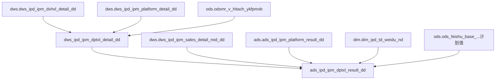

# 血缘关系文档 - 单平台销量

## 基本信息
- **需求ID**: 008-single-platform-sales
- **血缘版本**: 1.0
- **生成日期**: 2026-04-29
- **状态**: 活跃

## 数据流转概览
```
[DWS层] dws_ipd_ipm_dptxl_detail_dd
  ← dws.dws_ipd_ipm_dxhxl_detail_dd (单型号销量明细，提供型号+销量)
  ← dws.dws_ipd_ipm_platform_detail_dd (产品平台数明细，日立关联)
  ← ods.odsmr_v_hitach_ykfpmxb (日立管报数据)
         ↓
[ADS层] ads_ipd_ipm_dptxl_result_dd
  ← dws.dws_ipd_ipm_dxhxl_detail_dd (内销销量汇总)
  ← dws.dws_ipd_ipm_sales_detail_mid_dd (外销sellin数据)
  ← ads.ads_ipd_ipm_platform_result_dd (平台数)
  ← dim.dim_ipd_td_weidu_nd (维度配置)
  ← dw.dim_date_nd (日期维度)
  ← ods.ods_feishu_base_...tblugJ2ghgEELtWU (飞书计划值)
```

## 血缘关系图


## 核心关联路径

### 内销单平台销量
1. 冰冷洗/空调/视像科技：单型号销量明细 → 筛选在产+平台有效 → 按平台汇总
2. 日立：产品平台数明细 → 关联日立管报 → 按平台汇总

### 外销单平台销量
1. 各产品线：单型号销量明细（sellin口径）→ 筛选在产+平台有效 → 按平台汇总

### ADS层计算
1. 总销量 = 各产品线在销型号管报销量汇总（内销）+ sellin销量汇总（外销）
2. 平台数 = ads.ads_ipd_ipm_platform_result_dd 中的平台数
3. 单平台销量 = 总销量 / 平台数

## 详细血缘关系

### 1. 源表（输入）
| 表名 | 数据库 | 用途 |
|------|--------|------|
| dws_ipd_ipm_dxhxl_detail_dd | dws | 单型号销量明细（内销管报数据） |
| dws_ipd_ipm_platform_detail_dd | dws | 产品平台数明细（日立平台关联） |
| dws_ipd_ipm_sales_detail_mid_dd | dws | 外销sellin全量数据 |
| odsmr_v_hitach_ykfpmxb | ods | 日立管报数据（销量/销额/成本/毛利率） |
| ads_ipd_ipm_platform_result_dd | ads | 产品平台数结果（提供平台数分母） |
| ads_ipd_ipm_platform_library_result_dd | ads | 平台库结果（平台库口径） |
| dim_ipd_td_weidu_nd | dim | 维度配置 |
| dim_date_nd | dw | 日期维度 |

### 2. 目标表（输出）
| 表名 | 数据库 | 用途 |
|------|--------|------|
| dws_ipd_ipm_dptxl_detail_dd | dws | 单平台销量明细表 |
| ads_ipd_ipm_dptxl_result_dd | ads | 单平台销量结果表 |

### 3. 字段级血缘（DWS层核心字段）
| 源字段 | 源表 | 目标字段 | 目标表 | 转换逻辑 |
|--------|------|----------|--------|----------|
| model | dws_dxhxl_detail | model | dws_dptxl_detail | 产品型号名称 |
| platform | dws_platform_detail | platform | dws_dptxl_detail | 型号关联的平台名称 |
| sales_qty | dws_dxhxl_detail | sales_qty | dws_dptxl_detail | 型号销量（内销管报） |
| sales_amt | dws_dxhxl_detail | sales_amt | dws_dptxl_detail | 型号销额（内销管报） |
| product_line | dws_dxhxl_detail | product_line | dws_dptxl_detail | 直接映射 |
| is_project | dws_dxhxl_detail | is_project | dws_dptxl_detail | 同步在产型号数和平台数的保护期 |
| 日立销量 | odsmr_v_hitach_ykfpmxb | sales_qty(日立) | dws_dptxl_detail | 日立管报销量 |

### 4. 字段级血缘（ADS层核心字段）
| 源字段 | 源表 | 目标字段 | 目标表 | 转换逻辑 |
|--------|------|----------|--------|----------|
| sales_qty | dws_dptxl_detail + sellin | sum_qty | ads结果 | SUM(sales_qty) 月度/年累 |
| act_value | ads_platform_result | platform_num | ads结果 | 平台数（从平台数结果表获取） |
| sum_qty / platform_num | — | dptxl | ads结果 | 单平台销量 = 总销量 / 平台数 |
| sum_amt / platform_num | — | dptxe | ads结果 | 单平台销额 = 总销额 / 平台数 |
| — | ods飞书计划值 | plan_dptxl | ads结果 | 从飞书表获取计划值 |
| dptxl / plan_dptxl | — | completion_rate_dptxl | ads结果 | 完成率 = 实际值 / 计划值 |

## 变更记录
| 变更日期 | 变更类型 | 变更描述 | 变更人 |
|----------|----------|----------|--------|
| 2026-04-29 | 新增 | 初始血缘关系（从已有脚本录入） | ETL智能辅助工具 |
