1. 需求概述
1.1 需求背景/痛点（业务填写）
新PLM 系统上线后，系统中缺少详细的设计变更单报表，缺少相应的分析维度的字段，不利于对设计变更的管理：如①缺少对应的实施维度，无法获得变更单发布了多少，实施了多少，未实施及超期未实施有多少，不利于监控变更的实施；②缺少变更原因字段，无法根据变更原因监控相应类别的完成情况；③对于降本的项目，无法判断对应细类消耗周期是否满足要求。
1.2 需求目标（业务填写）
1.开发设计变更数据导出报表功能，从PLM系统获取设计变更发布数据、相应的MCO数据和产品线维度，并对接BPM流程或者采购会签的节点时间。
2.开发前端展示报表，实现设计变更发布数据的展示监控。
1.3 预期收益/效率提升（业务填写）
1.效率提升：每月人工登记变更及跟踪，原方式手工统计，可减少人工统计工作时长每次约16个人工时，并且反馈质量低，年度减少工时3840。
2.其他预期收益，量化计算，或做出非量化的说明
1.4.1 数据取数逻辑（业务填写）
①PLM数据：步骤一，变更报表统计-设计变更+MCO
1.4.2 加工逻辑（业务填写）
提供指标数据的加工逻辑和特殊规则，如：
1.设计变更发布日期筛选框：按开始月度、结束月度进行筛选；
2.所属公司筛选：下拉选项框，可多选，报表进入时默认全选。
3.发起部门筛选：下拉选项框，可多选，报表进入时默认全选。
4.所属工厂筛选框：下拉选项框，可多选，报表进入时默认全选。
5.变更原因筛选：下拉选项框，可多选，报表进入时默认全选。
6. 变更阶段筛选：下拉选项框，可多选，报表进入时默认全选
7.变更级别筛选：下拉选项框，可多选，报表进入默认全选。
表一  设计变更单实施率完成情况-柱状图
设计变更已实施率：分子取各公司设计变更的生命周期状态为已完成和变更已实施的数量之和，分母取各公司生命周期状态除草稿外的其余状态的数量之和。
注：设计变更编号去重取数
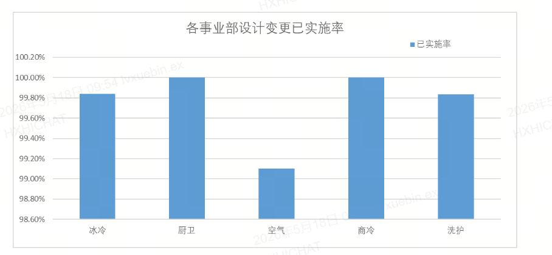

表二  变更原因分类占比-饼图  条目只取括号外得字注：设计变更编号去重取数
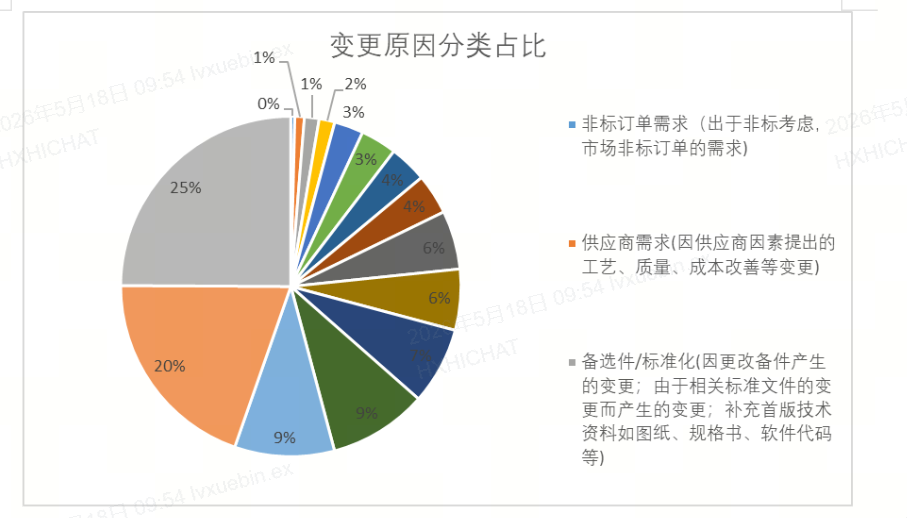

表三 变更阶段占比-饼图  注：设计变更编号去重取数
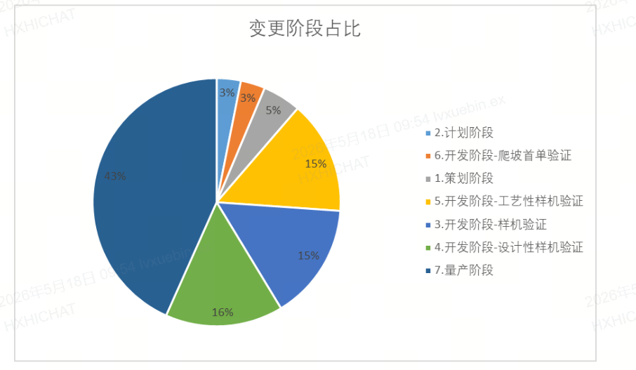

表四 变更级别占比-饼图    注：设计变更编号去重取数
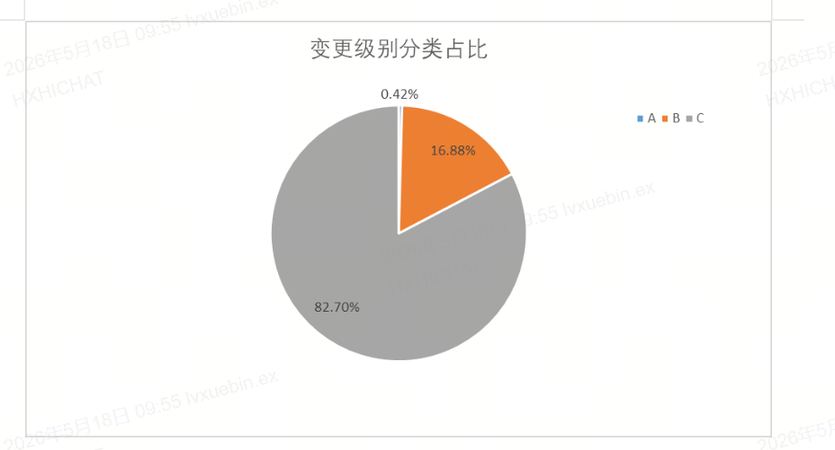

表五 生命周期状态占比-饼图     注：设计变更编号去重取数
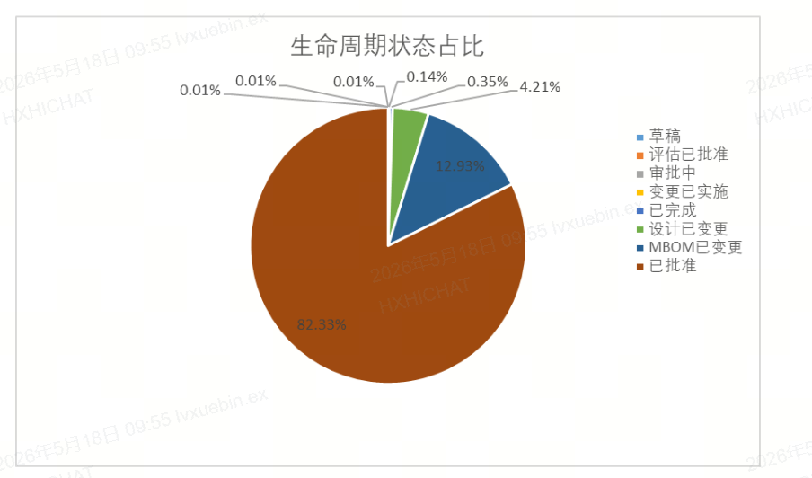

表六 各部门设计变更实施完成情况-柱状图和折线图注：设计变更编号去重取数
已实施率：分子取相应部门设计变更的生命周期状态为已完成和变更已实施的数量之和，分母取生命周期状态除草稿外的其余状态的数量之和。本部门内，需要确定取值范围，部门取到二级部门--冰冷事业部取第三层及
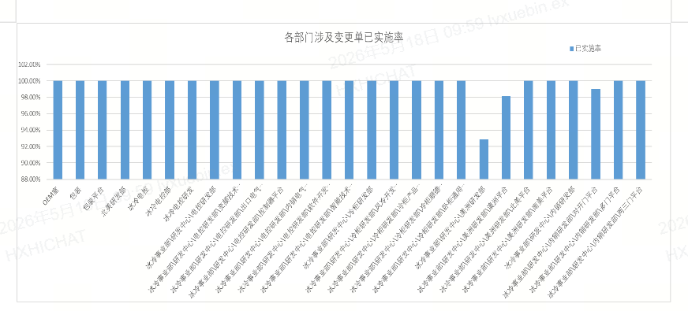

表七：各工厂设计变更完成情况注：MCO编号数量

①实施完成情况：-柱状图
MCO已实施率（已实施数量/总数）：分子取本工厂MCO成熟度状态为已实施数量之和，分母取本工厂MCO的数量之和。
MCO已完成率（已完成数量/总数）：分子取设计变更的生命周期状态为MCO完成的数量之和，分母取本工厂MCO的数量之和。
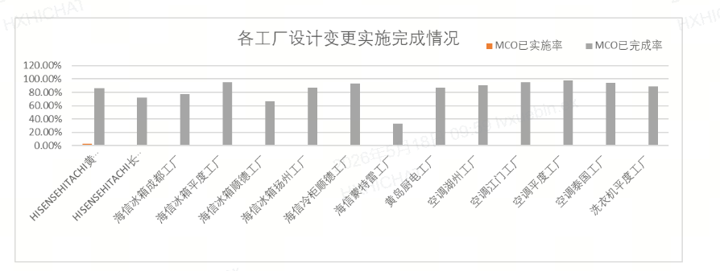

②未实施完成情况--柱状图和折线图
未实施率（1-已实施数量/总数）：分子取本工厂MCO成熟度状态除变更已实施之外其余数量之和，分母取本工厂MCO的数量之和。
超3个月未实施率为MCO超3个月未实施数量/MCO所有数量，分子MCO超3个月未实施数量取MCO中成熟度状态除变更已实施之外，实施周期用当前日期减去MCO的创建日期取大于90天的数量
以下仅为示例，无折线图
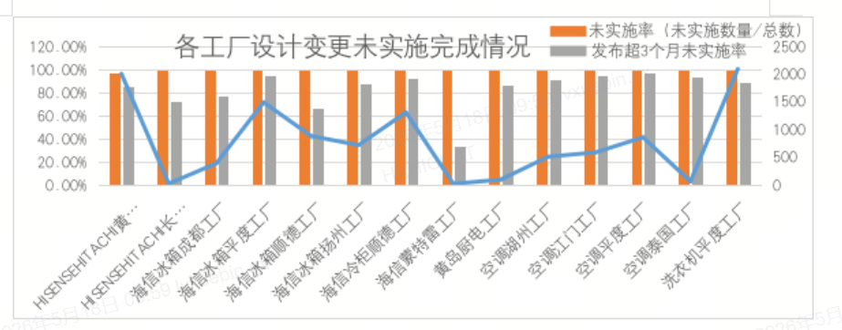

表八：各工厂工艺评估和采购评估未完成数量--柱状图
工艺评估未完成数量：取MCO成熟度状态为草稿的数量，
工艺评估未完成占比：取MCO成熟度状态为草稿的数量/（各工厂成熟度状态为草稿+工艺评估完成+采购评估完成的数量）
工艺未评估超2天的数量：1. 取MCO成熟度状态为草稿，2.取工艺评估处理总时长大于2天的数量
工艺未评估超2天的占比：工艺评估超2天的数量/工艺未完成的数量
采购评估未完成数量：取MCO成熟度状态为工艺评估完成的数量
采购评估未完成占比：采购评估未完成数量/（各工厂成熟度状态为草稿+工艺评估完成+采购评估完成的数量）
采购评估超3天的数量：1. 取MCO成熟度状态为工艺评估完成，2.取采购评估处理总时长大于3天的数量
采购评估超3天的数量占比：采购评估超3天的数量/采购评估未完成的数量
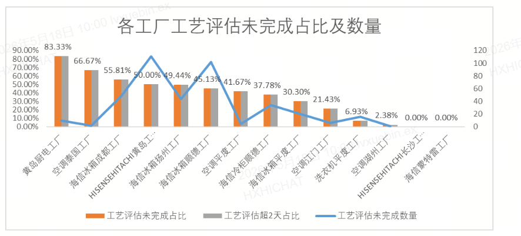

表九：各工厂工艺评估处理和采购评估处理平均时长-柱状图
工艺评估处理平均时长：MCO成熟度状态为工艺评估完成，取工艺评估处理总时长得平均值
采购评估处理平均时长：MCO成熟度状态为采购评估完成，取工艺评估处理总时长得平均值
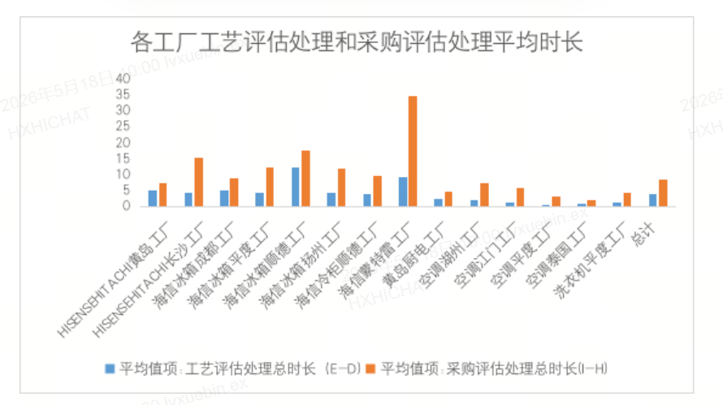

表十：各工厂MCO生效日已过实施情况-柱状图
柱形图：生效日已过未实施占比：MCO成熟度状态为MCO完成且生效日大于等于今天的数量/（MCO成熟度状态为MCO完成+变更已实施数量）
折线图：次坐标轴：MCO成熟度状态为MCO完成且生效日大于等于今天的数量
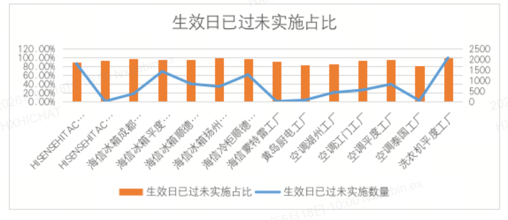
